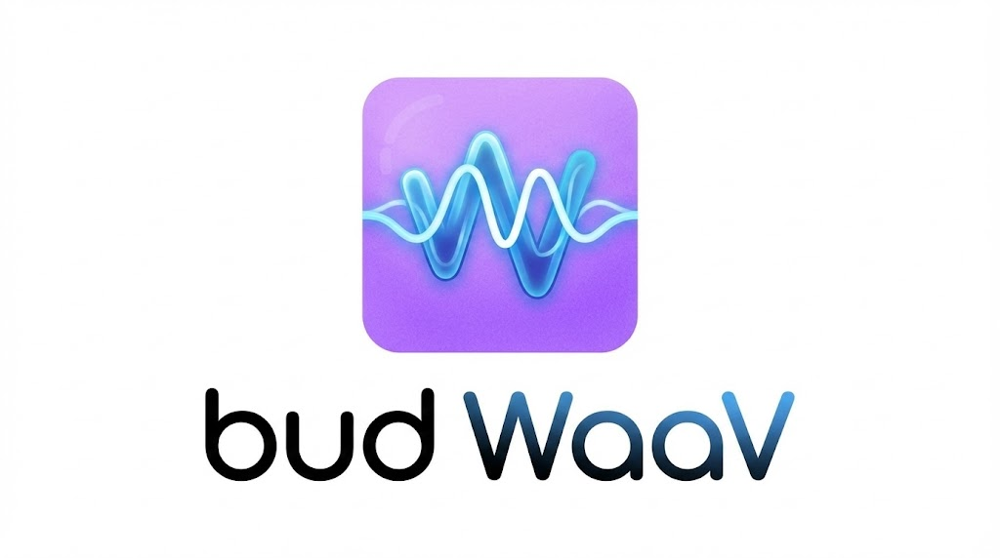
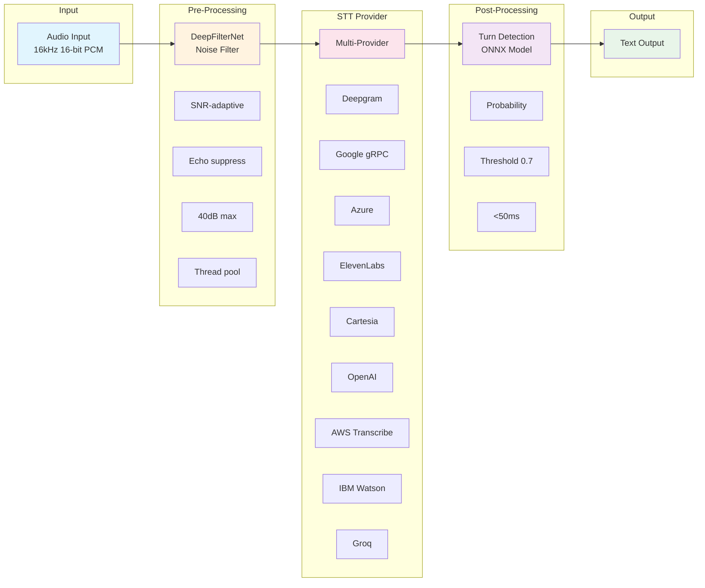
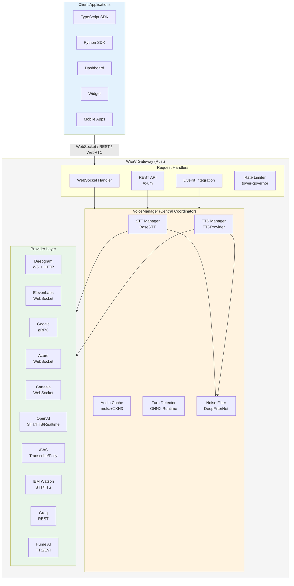

<p align="center">
  
</p>

<h1 align="center">WaaV Gateway</h1>

<p align="center">
  <strong>Real-Time Voice AI Gateway</strong>
</p>

<p align="center">
  <a href="#quick-start">Quick Start</a> •
  <a href="#features">Features</a> •
  <a href="#providers">Providers</a> •
  <a href="#client-sdks">SDKs</a> •
  <a href="#api-reference">API</a> •
  <a href="#configuration">Config</a>
</p>

<p align="center">
  
  
  
  
</p>

---

**WaaV Gateway** is a high-performance, real-time voice processing server built in Rust. It provides a unified interface for Speech-to-Text (STT) and Text-to-Speech (TTS) services across multiple cloud providers, with advanced audio processing capabilities including noise suppression and intelligent turn detection.

WaaV eliminates the complexity of integrating with multiple voice AI providers by providing a single WebSocket and REST API that abstracts away provider-specific implementations. Switch between Deepgram, ElevenLabs, Google Cloud, Azure, Cartesia, OpenAI, Amazon Transcribe, Amazon Polly, IBM Watson, or Groq with a simple configuration change—no code modifications required.

**Key Highlights:**
- **11 STT/TTS Providers** - Deepgram, ElevenLabs, Google Cloud, Azure, Cartesia, OpenAI, Amazon Transcribe, Amazon Polly, IBM Watson, Groq, Hume AI
- **OpenAI & Hume AI Realtime** - Full-duplex audio-to-audio streaming with GPT-4o and Hume EVI
- **WebSocket Streaming** - Real-time bidirectional audio with sub-second latency
- **LiveKit Integration** - WebRTC rooms and SIP telephony support
- **Advanced Audio Processing** - DeepFilterNet noise suppression, ONNX-based turn detection
- **Production-Ready** - HTTP/2 connection pooling, intelligent caching, rate limiting, JWT auth

---

## Table of Contents

- [Quick Start](#quick-start)
- [Audio Processing Pipeline](#audio-processing-pipeline)
- [Features](#features)
- [Providers](#providers)
- [Architecture](#architecture)
- [Installation](#installation)
- [Client SDKs](#client-sdks)
- [API Reference](#api-reference)
- [Configuration](#configuration)
- [Performance](#performance)
- [Contributing](#contributing)
- [License](#license)

---

## Quick Start

Get your first transcription running in under 5 minutes:

```bash
# Clone the repository
git clone https://github.com/bud-foundry/waav.git
cd waav/gateway

# Configure (add your API key)
cp config.example.yaml config.yaml
# Edit config.yaml and set your deepgram_api_key

# Build and run
cargo run --release

# Test health check
curl http://localhost:3001/
# Returns: {"status":"ok"}

# Test TTS
curl -X POST http://localhost:3001/speak \
  -H "Content-Type: application/json" \
  -d '{"text": "Hello from WaaV!", "tts_config": {"provider": "deepgram"}}' \
  --output hello.pcm

# Play the audio (requires sox)
play -r 24000 -e signed -b 16 -c 1 hello.pcm
```

---

## Audio Processing Pipeline

WaaV provides a complete audio processing pipeline with optional pre-processing and post-processing stages:



### Pre-Processing: DeepFilterNet Noise Suppression

**Feature flag:** `--features noise-filter`

Advanced noise reduction powered by [DeepFilterNet](https://github.com/Rikorose/DeepFilterNet):

| Feature | Description |
|---------|-------------|
| **Adaptive Processing** | SNR-based analysis—high SNR audio receives minimal filtering to preserve quality |
| **Energy Analysis** | Automatic silence detection, skips processing after 5 consecutive silent frames |
| **Echo Suppression** | Post-filter with 0.02 beta for mobile and conference call optimization |
| **Attenuation Limiting** | 40dB maximum reduction prevents over-processing artifacts |
| **Thread Pool** | One worker thread per CPU core for parallel processing |
| **Short Audio Handling** | Light 80Hz high-pass filter for clips under 1 second |

### Post-Processing: Turn Detection

**Feature flag:** `--features turn-detect`

Intelligent end-of-turn detection using ONNX Runtime with LiveKit's turn-detector model:

| Feature | Description |
|---------|-------------|
| **Model** | SmolLM-based from HuggingFace ([livekit/turn-detector](https://huggingface.co/livekit/turn-detector)) |
| **Threshold** | Configurable (default 0.7), per-language thresholds supported |
| **Tokenization** | HuggingFace tokenizers with chat template formatting |
| **Performance** | < 50ms prediction target with warnings for slower inference |
| **Quantization** | INT8 quantized ONNX model for faster inference |
| **Graph Optimization** | Level 3 ONNX optimization for maximum performance |

---

## Features

### Core Capabilities

- **WebSocket Streaming** (`/ws`) - Real-time bidirectional audio/text with provider switching
- **REST API** - TTS synthesis, voice listing, health checks
- **LiveKit Integration** - WebRTC rooms, SIP webhooks, participant management
- **Multi-Provider Support** - Unified interface across 5 major providers
- **Audio Caching** - Intelligent TTS response caching with XXH3 hashing
- **Rate Limiting** - Token bucket per-IP rate limiting with configurable limits
- **JWT Authentication** - Optional API authentication with external validation

### Performance Optimizations

| Feature | Technology | Benefit |
|---------|------------|---------|
| HTTP/2 Connection Pooling | ReqManager | Reduced latency, connection reuse |
| Audio Caching | moka + XXH3 | Sub-millisecond cache lookups |
| Zero-Copy Pipeline | Bytes crate | 4.1x memory improvement |
| Rate Limiting | tower-governor | Token bucket per-IP protection |
| TLS | rustls | No OpenSSL dependency, cross-compilation support |

### Optional Features

| Flag | Description | Use Case |
|------|-------------|----------|
| `turn-detect` | ONNX-based turn detection | Conversational AI, voice agents |
| `noise-filter` | DeepFilterNet noise suppression | Noisy environments, mobile apps |
| `openapi` | OpenAPI 3.1 spec generation | API documentation |

```bash
# Enable all optional features
cargo build --release --features turn-detect,noise-filter,openapi
```

---

## Providers

### Speech-to-Text (STT)

| Provider | Protocol | Models | Features |
|----------|----------|--------|----------|
| **Deepgram** | WebSocket | nova-3, nova-2, whisper | Streaming, interim results, VAD, punctuation |
| **Google Cloud** | gRPC | chirp, latest_long, latest_short | Streaming, automatic punctuation |
| **ElevenLabs** | WebSocket | Flash, Eleven, ElevenScribe | Streaming STT, VAD-based |
| **Azure** | WebSocket | Neural models | Streaming, interim results |
| **Cartesia** | WebSocket | ink-whisper | Low-latency streaming |
| **OpenAI** | REST | whisper-1, gpt-4o-transcribe | Batch transcription, 57+ languages |
| **Amazon Transcribe** | AWS SDK | Streaming | 100+ languages, speaker diarization, PII redaction |
| **IBM Watson** | WebSocket | Next-gen models | 30+ languages, speaker diarization, smart formatting |
| **Groq** | REST | whisper-large-v3, whisper-large-v3-turbo | Ultra-fast (216x real-time), translation endpoint |

### Text-to-Speech (TTS)

| Provider | Protocol | Voices | Features |
|----------|----------|--------|----------|
| **Deepgram** | HTTP | 102 Aura voices | Multiple languages, streaming |
| **ElevenLabs** | WebSocket | Premium voices | Voice tuning, pronunciation, streaming |
| **Google Cloud** | gRPC | WaveNet, Neural2 | SSML support, multiple languages |
| **Azure** | WebSocket | 400+ neural voices | SSML, streaming |
| **Cartesia** | WebSocket | Sonic-3, custom clones | Low-latency, voice mixing |
| **OpenAI** | HTTP | 11 voices (alloy, nova, etc.) | tts-1, tts-1-hd, gpt-4o-mini-tts |
| **Amazon Polly** | AWS SDK | 60+ voices (Joanna, Matthew, etc.) | Neural, Standard, Generative engines, SSML |
| **IBM Watson** | HTTP | 30+ V3 neural voices | 15+ languages, SSML, rate/pitch control |
| **Hume AI** | HTTP/WebSocket | Octave voices | Natural language emotion control, voice cloning, acting instructions |

### Audio-to-Audio (Realtime)

| Provider | Protocol | Models | Features |
|----------|----------|--------|----------|
| **OpenAI** | WebSocket | gpt-4o-realtime-preview | Full-duplex streaming, function calling, VAD |
| **Hume AI EVI** | WebSocket | EVI 3 | Empathic voice interface, 48 emotion dimensions, prosody analysis |

---

## Architecture



---

## Installation

### From Source (Recommended)

```bash
# Clone and build
git clone https://github.com/bud-foundry/waav.git
cd waav/gateway
cargo build --release

# Run with config
./target/release/waav-gateway -c config.yaml
```

### Docker

```bash
# Build image
docker build -t waav-gateway .

# Run container
docker run -p 3001:3001 \
  -v $(pwd)/config.yaml:/config.yaml \
  -e DEEPGRAM_API_KEY=your-key \
  waav-gateway
```

### With Feature Flags

```bash
# Enable noise filtering and turn detection
cargo build --release --features turn-detect,noise-filter

# Enable OpenAPI documentation generation
cargo build --release --features openapi
cargo run --features openapi -- openapi -o docs/openapi.yaml
```

### Download Turn Detection Assets

If using the `turn-detect` feature, download the required model and tokenizer:

```bash
cargo run --features turn-detect -- init
```

---

## Client SDKs

### TypeScript SDK

```bash
npm install @bud-foundry/sdk
```

```typescript
import { BudClient } from '@bud-foundry/sdk';

const bud = new BudClient({
  baseUrl: 'http://localhost:3001',
  apiKey: 'your-api-key'  // Optional if auth not required
});

// Speech-to-Text
const stt = await bud.stt.connect({ provider: 'deepgram' });
stt.on('transcript', (result) => {
  console.log(result.is_final ? `Final: ${result.text}` : `Interim: ${result.text}`);
});
await stt.startListening();

// Text-to-Speech
const tts = await bud.tts.connect({ provider: 'elevenlabs' });
await tts.speak('Hello from WaaV!');

// Bidirectional Voice
const talk = await bud.talk.connect({
  stt: { provider: 'deepgram' },
  tts: { provider: 'elevenlabs' }
});
await talk.startListening();

// OpenAI STT/TTS
const sttOpenAI = await bud.stt.connect({
  provider: 'openai',
  model: 'whisper-1'
});

const ttsOpenAI = await bud.tts.connect({
  provider: 'openai',
  model: 'tts-1-hd',
  voice: 'nova'
});
await ttsOpenAI.speak('Hello from OpenAI!');

// Hume AI TTS with emotion control
const ttsHume = await bud.tts.connect({
  provider: 'hume',
  voice: 'Kora',
  emotion: 'happy',
  emotionIntensity: 0.8,
  deliveryStyle: 'cheerful'
});
await ttsHume.speak('Hello from Hume AI with emotion!');
```

**Features:**
- Full STT/TTS streaming with typed events
- MetricsCollector for latency tracking (TTFT, connection time)
- Automatic reconnection with exponential backoff
- Browser and Node.js support

### Python SDK

```bash
pip install bud-foundry
```

```python
from bud_foundry import BudClient

bud = BudClient(base_url="http://localhost:3001", api_key="your-api-key")

# Speech-to-Text
async with bud.stt.connect(provider="deepgram") as session:
    async for result in session.transcribe_stream(audio_generator()):
        print(f"Transcript: {result.text}")

# Text-to-Speech
async with bud.tts.connect(provider="elevenlabs") as session:
    await session.speak("Hello from WaaV!")

# Bidirectional Voice
async with bud.talk.connect(
    stt={"provider": "deepgram"},
    tts={"provider": "elevenlabs"}
) as session:
    async for event in session:
        if event.type == "transcript":
            print(event.text)

# OpenAI STT/TTS
async with bud.stt.connect(provider="openai", model="whisper-1") as session:
    async for result in session.transcribe_stream(audio_generator()):
        print(f"Transcript: {result.text}")

async with bud.tts.connect(provider="openai", model="tts-1-hd", voice="nova") as session:
    await session.speak("Hello from OpenAI!")

# Hume AI TTS with emotion control
async with bud.tts.connect(
    provider="hume",
    voice="Kora",
    emotion="happy",
    emotion_intensity=0.8,
    delivery_style="cheerful"
) as session:
    await session.speak("Hello from Hume AI with emotion!")
```

**Features:**
- Async/await native support
- Context manager for automatic cleanup
- Streaming iterators
- Type hints (PEP 484)

### Dashboard (Testing UI)

A web-based testing interface for development:

```bash
cd clients_sdk/dashboard
npm install && npm run dev
```

**Features:**
- Real-time transcription display
- TTS synthesis panel with voice selection
- Metrics visualization (latency charts)
- WebSocket message inspector
- Provider switching

### Embeddable Widget

Drop-in voice widget for web applications:

```html
<script type="module">
  import { BudWidget } from '@bud-foundry/widget';
</script>

<bud-widget
  server="ws://localhost:3001/ws"
  provider="deepgram"
  mode="push-to-talk"
  theme="dark">
</bud-widget>
```

---

## API Reference

### REST Endpoints

| Endpoint | Method | Description |
|----------|--------|-------------|
| `/` | GET | Health check (returns `{"status":"ok"}`) |
| `/voices` | GET | List available TTS voices for a provider |
| `/speak` | POST | Synthesize speech from text |
| `/livekit/token` | POST | Generate LiveKit participant token |
| `/recording/{stream_id}` | GET | Download recording from S3 |
| `/sip/hooks` | GET/POST | Manage SIP webhook hooks |
| `/realtime` | WebSocket | OpenAI Realtime audio-to-audio streaming |

### WebSocket Protocol

Connect to `ws://host:3001/ws` for real-time voice processing.

**Configuration Message (JSON):**
```json
{
  "action": "configure",
  "provider": "deepgram",
  "model": "nova-3",
  "stt_config": {
    "interim_results": true,
    "punctuation": true,
    "language": "en-US"
  }
}
```

**Audio Data:** Send raw PCM audio as binary WebSocket frames (16-bit signed LE, mono).

**Response Messages:**
```json
// Ready message (after configuration)
{"type": "ready", "stream_id": "abc123"}

// Transcript message
{"type": "transcript", "text": "Hello world", "is_final": true}

// TTS audio (binary frame with header)
[binary audio data]

// Error message
{"type": "error", "message": "Provider connection failed"}
```

### TTS Request Example

```bash
curl -X POST http://localhost:3001/speak \
  -H "Content-Type: application/json" \
  -d '{
    "text": "Welcome to WaaV Gateway!",
    "tts_config": {
      "provider": "deepgram",
      "voice": "aura-asteria-en",
      "sample_rate": 24000
    }
  }' \
  --output speech.pcm
```

**Response Headers:**
- `Content-Type: audio/pcm`
- `X-Audio-Format: linear16`
- `X-Sample-Rate: 24000`

---

## Configuration

WaaV uses YAML configuration with environment variable overrides. Create `config.yaml`:

```yaml
# Server configuration
server:
  host: "0.0.0.0"
  port: 3001
  tls:
    enabled: false
    cert_path: "/path/to/cert.pem"
    key_path: "/path/to/key.pem"

# Security settings
security:
  rate_limit_requests_per_second: 60    # ENV: RATE_LIMIT_REQUESTS_PER_SECOND
  rate_limit_burst_size: 10             # ENV: RATE_LIMIT_BURST_SIZE
  max_connections_per_ip: 100

# Provider API keys
providers:
  deepgram_api_key: ""                  # ENV: DEEPGRAM_API_KEY
  elevenlabs_api_key: ""                # ENV: ELEVENLABS_API_KEY
  google_credentials: ""                # ENV: GOOGLE_APPLICATION_CREDENTIALS
  azure_speech_subscription_key: ""     # ENV: AZURE_SPEECH_SUBSCRIPTION_KEY
  azure_speech_region: "eastus"         # ENV: AZURE_SPEECH_REGION
  cartesia_api_key: ""                  # ENV: CARTESIA_API_KEY
  openai_api_key: ""                    # ENV: OPENAI_API_KEY
  aws_access_key_id: ""                 # ENV: AWS_ACCESS_KEY_ID
  aws_secret_access_key: ""             # ENV: AWS_SECRET_ACCESS_KEY
  aws_region: "us-east-1"               # ENV: AWS_REGION
  ibm_watson_api_key: ""                # ENV: IBM_WATSON_API_KEY
  ibm_watson_instance_id: ""            # ENV: IBM_WATSON_INSTANCE_ID
  ibm_watson_region: "us-south"         # ENV: IBM_WATSON_REGION
  groq_api_key: ""                      # ENV: GROQ_API_KEY
  hume_api_key: ""                      # ENV: HUME_API_KEY

# LiveKit configuration (optional)
livekit:
  url: "ws://localhost:7880"            # ENV: LIVEKIT_URL
  public_url: "http://localhost:7880"   # ENV: LIVEKIT_PUBLIC_URL
  api_key: "devkey"                     # ENV: LIVEKIT_API_KEY
  api_secret: "secret"                  # ENV: LIVEKIT_API_SECRET

# Authentication (optional)
auth:
  required: false                       # ENV: AUTH_REQUIRED
  service_url: ""                       # ENV: AUTH_SERVICE_URL
  signing_key_path: ""                  # ENV: AUTH_SIGNING_KEY_PATH

# Caching
cache:
  path: "/var/cache/waav-gateway"       # ENV: CACHE_PATH
  ttl_seconds: 2592000                  # ENV: CACHE_TTL_SECONDS (30 days)

# Recording storage (S3)
recording:
  s3_bucket: "my-recordings"            # ENV: RECORDING_S3_BUCKET
  s3_region: "us-west-2"                # ENV: RECORDING_S3_REGION
```

**Priority:** Environment Variables > YAML File > Defaults

---

## Performance

### Measured Benchmarks

| Metric | Value | Notes |
|--------|-------|-------|
| WebSocket Connect | < 25ms | Local connection |
| STT TTFT | ~1000ms | Deepgram nova-3, streaming |
| TTS First Chunk | ~500ms | Deepgram Aura |
| Concurrent Connections | 10+ | Stable under load |
| HTTP/2 Connection Reuse | 95%+ | ReqManager pooling |
| Cache Hit Latency | < 1ms | moka + XXH3 |

### Optimization Techniques

- **HTTP/2 Connection Pooling** - Persistent connections with automatic warmup
- **Audio Response Caching** - XXH3 content hashing for intelligent cache keys
- **Zero-Copy Pipeline** - `Bytes` crate for 4.1x memory improvement
- **Token Bucket Rate Limiting** - Per-IP protection with configurable limits
- **Release Profile** - LTO, single codegen unit, stripped binaries

```toml
# Cargo.toml release profile
[profile.release]
opt-level = 3
lto = "thin"
codegen-units = 1
strip = true
panic = "abort"
```

---

## Contributing

### Development Setup

```bash
# Clone and setup
git clone https://github.com/bud-foundry/waav.git
cd waav/gateway

# Run development server
cargo run -- -c config.yaml

# Run tests
cargo test

# Code style
cargo fmt && cargo clippy
```

### Building Documentation

```bash
# Generate OpenAPI spec
cargo run --features openapi -- openapi -o docs/openapi.yaml

# View API docs
open docs/openapi.yaml
```

### Project Structure

```
waav/
├── gateway/                 # Rust gateway server
│   ├── src/
│   │   ├── core/           # STT/TTS providers, voice manager
│   │   ├── handlers/       # WebSocket and REST handlers
│   │   ├── livekit/        # LiveKit integration
│   │   └── utils/          # Noise filter, caching, HTTP pooling
│   ├── docs/               # API documentation
│   └── tests/              # Integration tests
├── clients_sdk/
│   ├── typescript/         # TypeScript SDK
│   ├── python/             # Python SDK
│   ├── dashboard/          # Testing dashboard
│   └── widget/             # Embeddable widget
└── assets/                 # Logo and static assets
```

---

## License

WaaV Gateway is licensed under the [Apache License 2.0](LICENSE).

---

<p align="center">
  Built with Rust by <a href="https://bud-foundry.com">Bud Foundry</a>
</p>
