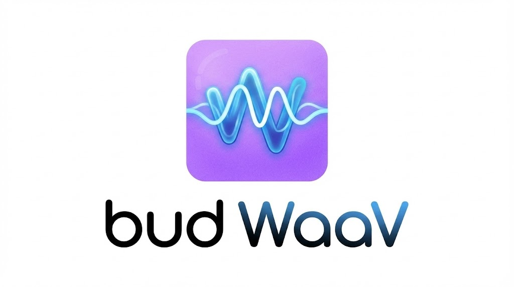
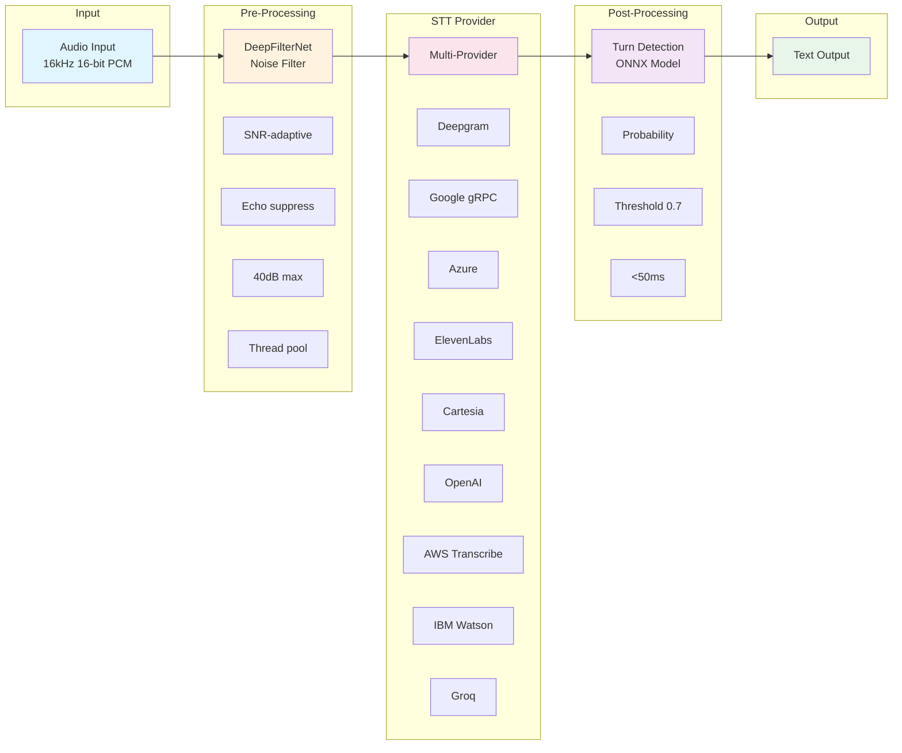
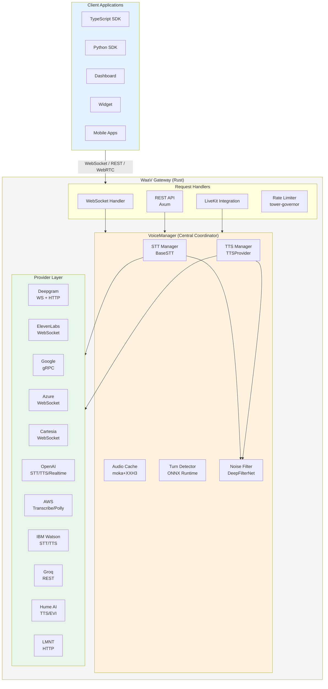

<p align="center">
  
</p>

<h1 align="center">WaaV Gateway</h1>

<p align="center">
  <strong>Real-Time Voice AI Gateway</strong>
</p>

<p align="center">
  <a href="#quick-start">Quick Start</a> •
  <a href="#features">Features</a> •
  <a href="#providers">Providers</a> •
  <a href="#client-sdks">SDKs</a> •
  <a href="#api-reference">API</a> •
  <a href="#configuration">Config</a>
</p>

<p align="center">
  
  
  
  
</p>

---

**WaaV Gateway** is a high-performance, real-time voice processing server built in Rust. It provides a unified interface for Speech-to-Text (STT) and Text-to-Speech (TTS) services across multiple cloud providers, with advanced audio processing capabilities including noise suppression and intelligent turn detection. WaaV features a powerful DAG-based pipeline engine for building custom voice processing workflows with conditional routing and multi-provider orchestration.

WaaV eliminates the complexity of integrating with multiple voice AI providers by providing a single WebSocket and REST API that abstracts away provider-specific implementations. Switch between Deepgram, ElevenLabs, Google Cloud, Azure, Cartesia, OpenAI, Amazon Transcribe, Amazon Polly, IBM Watson, Groq, or LMNT with a simple configuration change—no code modifications required.

**Key Highlights:**
- **[70+ Cloud Providers](gateway/docs/SUPPORTED_PROVIDERS.md)** - Global STT/TTS coverage including Deepgram, ElevenLabs, Google Cloud, Azure, OpenAI, plus regional providers for India (Sarvam, Gnani, Bhashini), China (Alibaba, Baidu, Tencent, iFlytek), Southeast Asia (Zalo, FPT, NECTEC), and more
- **DAG Pipeline Engine** - Build custom voice workflows with conditional routing, multi-provider orchestration, and data transformations
- **Realtime / Speech-to-Speech (12 providers)** - Full-duplex audio streaming on a shared S2S scaffold: OpenAI `gpt-realtime` (GA), Hume EVI, Azure, Grok, Inworld, Deepgram Voice Agent, ElevenLabs Conversational AI, Gemini Live, Ultravox, AWS Nova Sonic, Speechmatics Flow, Yandex — with reconnect/replay resilience and persistent reuse as a DAG node
- **WebSocket Streaming** - Real-time bidirectional audio with sub-second latency
- **LiveKit Integration** - WebRTC rooms and SIP telephony support
- **Advanced Audio Processing** - DeepFilterNet noise suppression, ONNX-based turn detection
- **Production-Ready** - HTTP/2 connection pooling, intelligent caching, rate limiting, JWT auth

---

## Table of Contents

- [Latest Updates](#latest-updates)
- [Quick Start](#quick-start)
- [Audio Processing Pipeline](#audio-processing-pipeline)
- [Realtime & Latency](#realtime--latency)
- [Realtime Reasoning](#realtime-reasoning)
- [Features](#features)
- [DAG Pipeline Engine](#dag-pipeline-engine)
- [Providers](#providers)
- [Architecture](#architecture)
- [Installation](#installation)
- [Client SDKs](#client-sdks)
- [API Reference](#api-reference)
- [Configuration](#configuration)
- [Performance](#performance)
- [Roadmap & TODO](#roadmap--todo)
- [Contributing](#contributing)
- [License](#license)

---

## Latest Updates

**June 2026 — SDK performance, resilience & full-duplex Opus codec.** A SOTA pass over the client SDKs (Python / TypeScript / embeddable widget) for **performance, connect-time, network resilience, and super-realtime behaviour** — grounded in a brutal review of the gateway internals and the Pipecat client — plus an end-to-end **Opus transport codec**. Shipped with before/after benchmarks + adversarial multi-agent verification; SDK suites Python **414** / TypeScript **295** / widget **60**, gateway lib **6,498** (default) / **6,504** (with the codec), **0 failing**. Designs: [`PERF_RESILIENCE_PLAN.md`](PERF_RESILIENCE_PLAN.md), [`OPUS_CODEC_PLAN.md`](OPUS_CODEC_PLAN.md).

- **Resilience.** An app-level zombie/half-open **liveness watchdog** (the gateway never pings clients) — live-proven to detect a frozen socket in **~2.5 s** instead of hanging forever — with verify-after-reconnect (a ping proves the new socket actually carries data), a client-side quick-failure breaker (a doomed config stops after 3 attempts, not an infinite storm), network-change probing (online/offline/visibility), and a bounded close-handshake. The SDK deliberately does **not** duplicate the gateway's heavy upstream resilience (circuit-breaker / reconnect-governor / conversation-replay are upstream-only); on a client↔gateway drop it re-sends config + flushes the queue, which is correct and sufficient.
- **Realtime audio path.** Off-main-thread **AudioWorklet** capture (20 ms transferable frames), a **20 ms scheduled-chunk playout clock** with true barge-in (truncates within one server chunk via the gateway's `audio_out_chunk_ms`), and zero client-side downlink resampling by setting `tts_config.client_playback_rate` to the sink rate.
- **Connect-time & pooling.** Fixed a real bug — the connect timeout was **10 s** but `PROVIDER_READY` legitimately takes up to ~30 s for `audio=true`, so a healthy slow-cold-start connect was being aborted (now **35 s**); `prewarm()` to warm DNS/TLS (and the AudioContext) before the first gesture; an STT keepalive-silence frame to keep the upstream stream warm; REST connection pooling (wire-proven **8 calls → 1 TCP/TLS handshake** in Python); 429/503 back-off; and a WS connect-concurrency gate that cooperates with the gateway's per-IP rate bucket.
- **Bad-network & capture quality.** An adaptive **jitter buffer + packet-loss concealment** that self-bypasses on a clean network (zero added latency) and engages only when it measures arrival jitter — benchmarked **−73 % to −86 %** playout underruns under injected jitter/loss; `getUserMedia` echo-cancellation / noise-suppression / auto-gain defaults with overrides; a mic-silence watchdog for a dead/muted device; and **VAD hysteresis** (two-rail start/stop thresholds) that eliminates the false-segmentation a noisy room caused (**7.8 false starts → 0** in the bench).
- **Full-duplex Opus codec (paired gateway + SDK).** A negotiated transport codec on `/ws`: `stt_config.audio_in_codec` / `tts_config.audio_out_codec` = `linear16` (default) | `opus`, **one Opus packet per binary frame** each way (uplink the gateway decodes before STT; downlink it encodes the TTS egress, funnelled through one chunker chokepoint). It's a **cargo feature** (`--features opus-codec`) — **off by default so the default build carries zero libopus dependency** — and an Opus request on a build (or browser) without it **gracefully degrades to linear16**, echoing the effective codec back in the `ready` message so the client never mis-frames. The SDKs are negotiation-aware (TypeScript ships a WebCodecs encoder/decoder; Python + widget parse the negotiation and opt in). libopus builds fully offline (vendored, via CMake).

**June 2026 — Provider-agnostic standardization + rebuilt client SDKs (6-phase, live-validated).** WaaV now delivers its core promise — **switch providers/models without changing client code** — across every axis, with three drilled-out client SDKs (Python / TypeScript / embeddable widget). One canonical token maps to each provider's native form **server-side**, so the SDKs stay a thin, drift-guarded mirror. Shipped phase-by-phase with extreme-TDD + multi-agent brutal-review workflows + credential-free live validation against the running gateway (gateway lib **~6,490 tests, 0 failing**; SDKs Python **354** / TS **194** / widget **22**).

- **Canonical mappers (gateway-side, one source of truth).** `language` — one `en-US` works on every provider (`core/lang/`, 49 region-qualified BCP-47 locales + an alias resolver, mapping the 8-way Chinese fork / Sarvam `od-IN` / ElevenLabs ISO-639-1 downgrade / Baidu numeric / … per provider). `emotion`/`style` — a 44-variant canonical set where `emotion="excited"` becomes a Cartesia emotion array, an OpenAI `instructions` string, an ElevenLabs `[excited]` inline tag, or an Azure SSML style. `voice` — a `VoiceDescriptor{gender,locale,age,style}` resolved to a real provider `voice_id` over the unified `/voices` catalog. Unsupported → a typed `config_warning`, never a 400.
- **`bud.agent(...)` — a full voice agent in ~5 lines.** The flagship helper drives the gateway's built-in STT→LLM→TTS loop with reasoning, barge-in, and latency-filler, yielding one unified `transcript | audio | warning` event stream. Beginner-first DX that beats Pipecat's per-service wiring.
- **Proxy / alias model names.** A server-config alias maps a logical name to a full `{stt,tts,llm,dag}` bundle — `bud.agent(alias="support-bot")`. Re-point what "support-bot" means (swap providers, A/B, cost-tier) by editing server config; the client never changes (proven live: identical payload, provider swapped).
- **All call types, one SDK surface.** `bud.realtime(provider=…)` speaks the gateway's provider-agnostic `/realtime` protocol for **all 12 S2S providers**; `bud.transcribe_batch(...)` for async/prerecorded; `bud.voices.clone(...)` for instant + professional voice cloning; canonical in-stream **translation** (`translation={target_languages:[…]}`). 
- **Drift-guarded mirror.** A CI guard reads the gateway OpenAPI spec and fails the build if any config field is unreachable from the SDK — structurally killing the entire "feature exists server-side but the SDK silently drops it" bug class that had left TS transcripts empty and the whole reasoning loop unreachable.

**June 2026 — Realtime / Speech-to-Speech (S2S) fleet + full WaaV integration (live-validated).** WaaV's full-duplex realtime path grew from **2 providers to 12** on a shared, heavily-reviewed S2S scaffold, then was proven integrated with every relevant gateway subsystem — DAG, noise reduction, VAD, smart-turn, turn detection, the cascade audio sink, and circuit-breaker resilience — end-to-end through the **running gateway**. Shipped with extreme-TDD + multi-agent brutal-review (RCA / integration / impact / adversarial-verify workflows) + credential-free live validation; lib suite **6,400+ tests, 0 failing**.

- **Shared S2S scaffold.** A generic `RealtimeSession<P: RealtimeProtocol>` driver implements the reconnect supervisor, conversation replay, barge-in/truncate, and resilience **once**; each provider is a small pure protocol mapper + a thin newtype. A `RealtimeTransport` seam absorbs all transports — WS-JSON, WS-binary, REST-handshake→WS (Ultravox), and AWS Bedrock bidirectional HTTP/2 (Nova Sonic). The existing OpenAI client was migrated onto it under a byte-identical golden-wire oracle (every pre-existing test unchanged).
- **12 realtime/S2S providers.** OpenAI `gpt-realtime` (GA), Hume EVI, Azure OpenAI Realtime, xAI Grok, Inworld, Deepgram Voice Agent, ElevenLabs Conversational AI, Google Gemini Live, Ultravox, AWS Nova Sonic, Speechmatics Flow, and Yandex. **3 live-validated against real vendors** (OpenAI / Deepgram / ElevenLabs — full audio round-trips through `/realtime`); the other 9 are validated to the byte at the wire level (probe-grounded unit tests + credential-free mock round-trips through the *real* transport code), with the final real-vendor handshake pending a key (one command: `scripts/realtime_vendor_validation.py <provider>`).
- **Resilience, live-validated end-to-end.** The reconnect supervisor + conversation replay + quick-failure cutoff were validated through the real driver against a mock that drops mid-session — reconnect + session-config re-send + **verbatim conversation-log replay** + bounded no-storm cutoff. The shared per-provider **circuit breaker** now fast-trips on a bad-credential handshake-then-drop signature (cross-session storm control), and a terminally-dead session is surfaced to the client instead of held open silently.
- **Realtime as a DAG node (persistent S2S).** A `RealtimeProviderNode` now reuses **one** upstream socket across turns (retaining server-side conversation state) with a bounded teardown owner, wired into production and **live-validated credential-free** through the full gateway — a 3-turn DAG with the session reused (not reconnected per turn), audio riding the cascade `DagOutput::Audio` sink, and clean teardown, with anti-fabrication negative controls.
- **Front-end ↔ realtime, proven together.** A live test drives **real audio** through WaaV's audio front-end — DeepFilterNet noise reduction → silero-VAD → smart-turn → text turn-detector — into a realtime DAG node, asserting (via scraped `/metrics` counters + sink egress) that every optimization actually ran on the bytes. Adversarially verified with three negative controls (disabling the front-end drives smart-turn inference to zero and **fails** the test).

**June 2026 — OpenAI full-surface parity (live-validated).** Every OpenAI voice capability was brought up against the **real OpenAI API** with the full gateway running, end-to-end. Live testing caught two classes of breakage that unit tests (which only ever hit an OpenAI-*compatible* local endpoint) could not:

- **Reasoning models now actually work on the chat path.** OpenAI's o-series + gpt-5 family **reject `max_tokens`** (400: *"use `max_completion_tokens`"*) and reject sampling params — so WaaV's reasoning feature set was silently broken against production OpenAI (it only ever ran against ollama, which accepts `max_tokens`). The adapter now emits `max_completion_tokens` and suppresses temperature/top-p/penalties/logprobs for reasoning models. Live-verified: `gpt-5-mini` round-trips streaming + non-streaming, and the **full cascade** (Whisper STT → `gpt-5-mini` reasoning → TTS) speaks a correct answer end-to-end.
- **Realtime (S2S) migrated Beta → GA — it was 100 % broken.** WaaV spoke the **retired Realtime Beta API** (rejected outright by OpenAI). Probing the GA contract directly yielded the exact migration: drop the `OpenAI-Beta` header; nest the session under `audio.input`/`audio.output` with `{type:"audio/pcm",rate}` formats, `output_modalities`, and `session.type:"realtime"`; and follow GA's renamed server events (`response.output_audio.delta`, `response.output_audio_transcript.delta`, `conversation.item.added`). Live-verified S2S round-trip through `/realtime`: **`gpt-realtime`** + the new **`marin`/`cedar`** voices + **`near_field`/`far_field` noise reduction** → 170 KB of audio, first-audio ~1.8 s.
- **Surface refresh + chat-param parity.** New TTS + Realtime voices (`marin`, `cedar`); refreshed Realtime model enum (`gpt-realtime` GA default, `gpt-realtime-mini`); input-audio noise reduction; and `parallel_tool_calls` + `seed` + `presence_penalty` + `frequency_penalty` + `logprobs` + `user` first-classed on both the cascade **and** DAG LLM nodes (with reasoning-model-aware suppression). TTS validated live across 6 voice/format combos (wav/pcm/mp3/opus).
- **Streaming STT + per-response Realtime override + GA follow-ups (live-validated).** Streaming OpenAI STT (`gpt-4o-transcribe`/`-mini` `stream=true` SSE) now emits incremental partials → final — live-verified *10 interim partials then the final*; this also fixed a pre-existing bug where those models 400 on WaaV's `verbose_json` default (now coerced to `json`). Per-response Realtime override (`create_response_with` → GA `response.create`: per-turn modalities/instructions/voice/token-cap/out-of-band) — live-verified a text-only out-of-band override returning `ACKNOWLEDGED`. Two more GA misses fixed: the realtime handler default model (`gpt-4o-realtime-preview` → `gpt-realtime`) and the GA **text** output events (`response.output_text.delta`/`.done`), which were dropping text-modality output.
- **Cross-provider hardening (the same fixes, applied beyond OpenAI).** A multi-agent audit checked whether these fixes recur elsewhere. Fixed: the OpenAI reasoning-model detector no longer false-positives on `gpt-5*-chat-latest` (which *accept* sampling) and now catches `codex`/`computer-use` + future `o5`/`gpt-6..9`; Anthropic now honors `parallel_tool_calls:false` via its native `tool_choice.disable_parallel_tool_use`; Gemini now maps `seed`/`presence_penalty`/`frequency_penalty` into `generationConfig`. (Verified-but-deferred, needing live provider keys: a per-provider request-shape capability table for xAI/grok + DeepSeek-reasoner + Groq-Qwen3, a Cartesia `Cartesia-Version` header bump, and additive feature parity — see roadmap.)

**June 2026 — Realtime Reasoning release.** WaaV now runs **reasoning / "thinking" LLMs in live voice** — a class that was previously unusable on the spoken path (9–18 s to first audio, every trivial turn taxed, a stuck model hangs the call). A full opt-in, flat-configured feature set makes a slow "smart" model *feel instant* while a fast model handles the rest, with a safety net that guarantees the call never goes silent or drops. Shipped with extreme-TDD + multi-agent brutal-review + live validation (lib suite **~6,186 tests, 0 failing**; validated against OpenAI / Anthropic / Gemini-compatible endpoints + a credential-free ollama gate). See **[Realtime Reasoning](#realtime-reasoning)** and [`REALTIME_REASONING.md`](REALTIME_REASONING.md) / [`REASONING_FOLLOWUP_PLAN.md`](REASONING_FOLLOWUP_PLAN.md).

- **Two-tier router** — name a fast `model`; add one field `reasoning_model` to light up automatic escalation (complex / math / multi-turn → the reasoner; chit-chat stays fast), both tiers sharing one conversation history.
- **Latency masking** — `latency_filler` speaks a short holding phrase while the model thinks, so the caller hears a response in **~0.8 s** instead of seconds of silence; deduped to one utterance per turn, interruptible.
- **Never dead air, never dropped** — a stuck or stalled reasoner (`reasoning_budget_ms` max-silence-gap watchdog) degrades to the fast draft or a graceful spoken apology; a partial answer is committed, never talked over.
- **Reasoning-effort dial** — one typed `reasoning_effort` (off/minimal/low/medium/high) maps to each vendor's native control (OpenAI flat effort · Anthropic extended-thinking · Gemini thinking-budget), floor-clamped per model and provider-kind-aware, and emits **nothing** when a model can't reason (never a 400). Drives the cascade LLM path; the S2S mapping is retained for a reasoning-capable Realtime model (GA `gpt-realtime` exposes no session reasoning).
- **Chain-of-thought never spoken** — `<think>…</think>` reasoning emitted inline by DeepSeek-R1 / QwQ-class models (incl. via ollama) is stripped from TTS on both the conversation and DAG paths.
- **Cost-bounded** — a per-turn LLM-call ceiling (`max_llm_calls_per_turn`) + a reasoning-token cap (`max_reasoning_tokens`) keep the 2× two-tier spend in check on a billing gateway.

**June 2026 — Realtime & production-hardening release.** A full brutal audit + measured-latency rebuild landed across the gateway. Every change below ships with extreme-TDD coverage and was validated **live against real providers**. Detailed reports live alongside this README: [`AUDIT_REPORT.md`](AUDIT_REPORT.md), [`LATENCY_ANALYSIS.md`](LATENCY_ANALYSIS.md), [`REALTIME_ROADMAP.md`](REALTIME_ROADMAP.md), [`MASTER_PLAN.md`](MASTER_PLAN.md).

**Realtime**
- **Streaming WebSocket TTS** — Deepgram Aura over `wss://…/v1/speak` with per-utterance cancellation. Live-measured **first-audio ~510 ms vs ~1,510 ms** for the batch/HTTP path. Selected via the standardized `tts_config.features.streaming` flag; HTTP providers keep working unchanged.
- **Eager end-of-turn** — on a turn-complete *prediction*, the LLM starts speculatively with **staged history** (never mutated); a confirming final commits + speaks, a divergent one cancels with zero history pollution. Opt-in via `conversation_config.eager_eot`.
- **ML turn detection, standardized** — `stt_config.turn_detection { enabled, threshold, eager }` runs the smart-turn detector on the live frame path for *every* STT provider; feature-less builds degrade loudly.
- **Live latency profiler** — per-turn timeline (`audio_in → stt_final → llm_first_token → tts_first_audio → audio_out`) with bottleneck attribution, on Prometheus (`waav_turn_*`, `waav_frame_*`) + an auth-gated `GET /debug/profile` (JSON snapshot) and `/debug/profile/stream` (SSE), enabled with `WAAV_DEBUG_PROFILE=1`.

**Correctness & production-readiness**
- **Audio format truth** — magic-byte container sniffing (WAV/MP3/OGG/FLAC) at every audio boundary (HTTP stream, cache write, cache hit, and the universal egress point) so a container can never be sliced as PCM. Fixes the silent-corruption class fleet-wide.
- **Credential precedence** — placeholder values in `config.yaml` (e.g. `your-…-api-key`) are treated as unset so the documented `# ENV:` fallback applies; placeholders are never sent to a provider.
- **Speech-final state machine** — race-free generation-counter fire claims + deadline-rereading hard timeout; all turn-timing decisions use a monotonic clock (immune to NTP/VM clock steps).
- **Supervised reconnect** — circuit-breaker + storm-controlled reconnect governor across the streaming STT fleet (AssemblyAI migrated this release).
- **Hardware portability** — single ONNX execution-provider policy (`WAAV_ORT_EP=auto|cpu|cuda|tensorrt|coreml|directml|xnnpack`) with a guaranteed CPU fallback and per-EP availability probing.
- **Chaos lifecycle** — graceful SIGTERM session drain, per-message-class WebSocket backpressure (audio sheds stale frames, transcripts/errors never dropped), one-config-per-session, and a cached/optionally-token-gated `/metrics`.
- **Consolidated SSRF guard** — one canonical validator (`core::net`) for all client-supplied URLs (DAG endpoints, LLM base URLs, TTS endpoint overrides), closing IPv6-multicast / decimal-IP / CGNAT gaps.

> ⚠️ Some provider integrations beyond the live-validated set remain protocol-flagged; see [Roadmap & TODO](#roadmap--todo) and `AUDIT_REPORT.md` for the exact status per provider.

---

## Quick Start

Get your first transcription running in under 5 minutes:

```bash
# Clone the repository
git clone https://github.com/bud-foundry/waav.git
cd waav/gateway

# Configure (add your API key)
cp config.example.yaml config.yaml
# Edit config.yaml and set your deepgram_api_key

# Build and run
cargo run --release

# Test health check
curl http://localhost:3001/
# Returns: {"status":"ok"}

# Test TTS
curl -X POST http://localhost:3001/speak \
  -H "Content-Type: application/json" \
  -d '{"text": "Hello from WaaV!", "tts_config": {"provider": "deepgram"}}' \
  --output hello.pcm

# Play the audio (requires sox)
play -r 24000 -e signed -b 16 -c 1 hello.pcm
```

---

## Audio Processing Pipeline

WaaV provides a complete audio processing pipeline with optional pre-processing and post-processing stages:


```mermaid
flowchart LR
    subgraph Input
        A[Audio Input<br/>16kHz 16-bit PCM]
    end

    subgraph PreProcess["Pre-Processing"]
        B[DeepFilterNet<br/>Noise Filter]
        B1[SNR-adaptive]
        B2[Echo suppress]
        B3[40dB max]
        B4[Thread pool]
    end

    subgraph Transcription["STT Provider"]
        C[Multi-Provider]
        C1[Deepgram]
        C2[Google gRPC]
        C3[Azure]
        C4[ElevenLabs]
        C5[Cartesia]
        C6[OpenAI]
        C7[AWS Transcribe]
        C8[IBM Watson]
        C9[Groq]
    end

    subgraph PostProcess["Post-Processing"]
        D[Turn Detection<br/>ONNX Model]
        D1[Probability]
        D2[Threshold 0.7]
        D3["<50ms"]
    end

    subgraph Output
        E[Text Output]
    end

    A --> B
    B --> C
    C --> D
    D --> E

    style A fill:#e1f5fe
    style E fill:#e8f5e9
    style B fill:#fff3e0
    style C fill:#fce4ec
    style D fill:#f3e5f5
```

### Pre-Processing: DeepFilterNet Noise Suppression

**Feature flag:** `--features noise-filter`

Advanced noise reduction powered by [DeepFilterNet](https://github.com/Rikorose/DeepFilterNet):

| Feature | Description |
|---------|-------------|
| **Adaptive Processing** | SNR-based analysis—high SNR audio receives minimal filtering to preserve quality |
| **Energy Analysis** | Automatic silence detection, skips processing after 5 consecutive silent frames |
| **Echo Suppression** | Post-filter with 0.02 beta for mobile and conference call optimization |
| **Attenuation Limiting** | 40dB maximum reduction prevents over-processing artifacts |
| **Thread Pool** | One worker thread per CPU core for parallel processing |
| **Short Audio Handling** | Light 80Hz high-pass filter for clips under 1 second |

### Post-Processing: Turn Detection

**Feature flag:** `--features turn-detect`

Intelligent end-of-turn detection using ONNX Runtime with LiveKit's turn-detector model:

| Feature | Description |
|---------|-------------|
| **Model** | SmolLM-based from HuggingFace ([livekit/turn-detector](https://huggingface.co/livekit/turn-detector)) |
| **Threshold** | Configurable (default 0.7), per-language thresholds supported |
| **Tokenization** | HuggingFace tokenizers with chat template formatting |
| **Performance** | < 50ms prediction target with warnings for slower inference |
| **Quantization** | INT8 quantized ONNX model for faster inference |
| **Graph Optimization** | Level 3 ONNX optimization for maximum performance |

---

## Realtime & Latency

WaaV is built for **natural-conversation latency** — the user-perceived metric is *end-of-speech → first response audio*. The gateway's own orchestration overhead is **~12 ms** (measured); the budget is dominated by provider/network cost, which WaaV minimizes through streaming overlap and turn prediction.

**The budget (measured, this host → provider):**

| Stage | Cost | Lever |
|-------|------|-------|
| STT finalization | ~250–700 ms (endpointing) | ML turn detection (`turn_detection.enabled`) predicts end-of-turn early |
| Gateway glue | **~12 ms** | n/a — not the bottleneck |
| LLM time-to-first-token | provider-dependent | a fast, low-TTFT model — **or** a reasoning model via the two-tier [Realtime Reasoning](#realtime-reasoning) path (masked + routed so it *feels* instant) |
| TTS first-audio | **~510 ms streaming** / ~1,510 ms batch | `tts_config.features.streaming` |

**Make it realtime:**
1. `tts_config.features.streaming: true` — WebSocket TTS (Deepgram Aura today).
2. A low-TTFT LLM in `conversation_config` (or DAG `llm` node) — **or** add a `reasoning_model` for the masked + routed two-tier [Realtime Reasoning](#realtime-reasoning) path.
3. `stt_config.turn_detection.enabled: true` (+ `eager: true` and `conversation_config.eager_eot: true` for speculative starts).
4. Watch it live: `WAAV_DEBUG_PROFILE=1` then `GET /debug/profile` — per-turn p50/p90/p99 per stage, bottleneck histogram, and a `realtime_blockers` block.

See [`LATENCY_ANALYSIS.md`](LATENCY_ANALYSIS.md) for the full measured breakdown and [`REALTIME_ROADMAP.md`](REALTIME_ROADMAP.md) for the SOTA-researched path to sub-300 ms.

---

## Realtime Reasoning

Reasoning ("thinking") LLMs — OpenAI o-series, DeepSeek-R1, QwQ, Claude / Gemini extended-thinking — give far better answers but are **9–18 s to first user-visible token** (they think before they speak). Naively dropped onto a voice call that is unusable: the caller hears seconds of dead silence, every trivial turn pays the full reasoning tax, and a stuck model hangs the line.

WaaV makes a reasoning LLM **feel instant in voice** — perceived first response **~0.8 s**, a fast model handling everything that doesn't need deep thought, and a safety net so the call never goes silent or drops. Everything is opt-in and flat-configured next to the existing `conversation_config` fields.

**Two fields is the whole mental model:** name a fast `model`; add `reasoning_model` for a smart-but-slow brain.

```jsonc
{
  "conversation": {
    "model": "gpt-4o-mini",          // fast tier — handles simple turns at ~170 ms
    "reasoning_model": "o3",         // ← presence lights up two-tier routing + masking

    // ── optional tuning (all flat, all safe-defaulted) ──
    "reasoning_route": "auto",       // auto (heuristic escalation) | always
    "reasoning_effort": "low",       // off|minimal|low|medium|high  (vendor-mapped, floor-clamped)
    "latency_filler": "auto",        // off|auto|aggressive — mask the think-gap
    "reasoning_budget_ms": 15000,    // max silence (to first audio OR between chunks) → degrade
    "max_reasoning_tokens": 4096,    // reasoning-tier output ceiling (cost)
    "max_llm_calls_per_turn": 8,     // per-turn re-inference ceiling (cost)
    "degradation_message": null      // spoken apology when every tier fails (null = built-in)
    // reasoning_base_url / reasoning_api_key / reasoning_provider_kind — optional, for a
    // cross-vendor reasoning tier (e.g. fast = local ollama, reasoning = OpenAI o3)
  }
}
```

**What you get:**

| Capability | Config | Behaviour |
|---|---|---|
| **Two-tier routing** | `reasoning_model`, `reasoning_route` | a word-aware heuristic escalates complex / multi-step-math / multi-turn-follow-up turns to the reasoner and keeps billing/sales chit-chat (`"not interested"`, `"no refund"`) on the fast tier; both tiers share one history |
| **Latency masking** | `latency_filler` (+ `latency_filler_after_ms`, `latency_filler_phrases`) | one short holding phrase while the model thinks → perceived first audio ~0.8 s; interruptible; one per turn; deduped vs the model's own filler |
| **Reasoning-effort dial** | `reasoning_effort` | typed enum → OpenAI `reasoning_effort` / Anthropic `thinking{budget}` / Gemini `thinkingBudget`; floor-clamped per model; provider-kind-aware; **emits nothing when a model can't reason** (no 400s); sampling params suppressed when thinking is on |
| **Stall watchdog + degradation** | `reasoning_budget_ms`, `degradation_message` | a reasoner with no audio — or frozen mid-stream — past the budget degrades to the fast draft / a graceful spoken apology; a partial answer is committed, never restarted-over; the session never drops |
| **Cost budget** | `max_reasoning_tokens`, `max_llm_calls_per_turn` | bound the reasoning tier's token + call spend (eager/two-tier/escalation all multiply spend on a billing gateway) |
| **Chain-of-thought stripping** | automatic | `<think>…</think>` is never spoken to the caller (conversation **and** DAG paths) |
| **Realtime (S2S)** | `reasoning_effort` | mapping is retained for a reasoning-capable Realtime model; GA `gpt-realtime` exposes no session-level reasoning, so the field is omitted there (no 400) — the dial drives the cascade LLM path today |

**Measured (live, ollama; the gateway's own overhead is ~12 ms):**

| | Reasoner naive (single-tier) | WaaV two-tier + masking |
|---|---|---|
| Simple turn (`"hi"`) | full reasoning latency (8.9 s+) | **~0.17 s** (routed to the fast tier) |
| Complex turn — *perceived* first audio | 8.9–18 s of silence | **~0.8 s** (`"one moment"`, then the answer) |
| Stuck / looping reasoner | hangs to the request timeout | **bounded by `reasoning_budget_ms`** → fast fallback |
| Chain-of-thought | spoken aloud | **stripped** |

The reasoned *answer* still takes its compute time — masking makes it *feel* responsive, routing keeps it off the cheap turns, and the watchdog guarantees it never hangs. A repeatable harness (`live_reasoning_before_after_measurement`, `#[ignore]`) measures the before/after on your own hardware. Full design + adversarial critique: [`REALTIME_REASONING.md`](REALTIME_REASONING.md), [`REASONING_FOLLOWUP_PLAN.md`](REASONING_FOLLOWUP_PLAN.md).

---

## Features

### Core Capabilities

- **WebSocket Streaming** (`/ws`) - Real-time bidirectional audio/text with provider switching
- **Realtime Reasoning** - run thinking/reasoning LLMs in live voice: two-tier fast+reasoning routing, latency masking, a stall/degradation safety net, cost budgets, a per-vendor effort dial, and automatic chain-of-thought stripping ([details](#realtime-reasoning))
- **REST API** - TTS synthesis, voice listing, health checks
- **LiveKit Integration** - WebRTC rooms, SIP webhooks, participant management
- **Multi-Provider Support** - Unified interface across [70+ global providers](gateway/docs/SUPPORTED_PROVIDERS.md)
- **Audio Caching** - Intelligent TTS response caching with XXH3 hashing
- **Rate Limiting** - Token bucket per-IP rate limiting with configurable limits
- **JWT Authentication** - Optional API authentication with external validation

### Performance Optimizations

| Feature | Technology | Benefit |
|---------|------------|---------|
| HTTP/2 Connection Pooling | ReqManager | Reduced latency, connection reuse |
| Audio Caching | moka + XXH3 | Sub-millisecond cache lookups |
| Zero-Copy Pipeline | Bytes crate | 4.1x memory improvement |
| Rate Limiting | tower-governor | Token bucket per-IP protection |
| TLS | rustls | No OpenSSL dependency, cross-compilation support |

### Optional Features

| Flag | Description | Use Case |
|------|-------------|----------|
| `dag-routing` | DAG-based pipeline engine | Custom voice workflows, multi-provider orchestration |
| `turn-detect` | ONNX-based turn detection | Conversational AI, voice agents |
| `noise-filter` | DeepFilterNet noise suppression | Noisy environments, mobile apps |
| `opus-codec` | Full-duplex Opus transport codec on `/ws` (`audio_in_codec`/`audio_out_codec`) | Bandwidth-constrained / mobile clients; bad-network resilience |
| `openapi` | OpenAPI 3.1 spec generation | API documentation |

```bash
# Enable all optional features
cargo build --release --features dag-routing,turn-detect,noise-filter,openapi
```

---

## Providers

> **[View All 70+ Supported Providers](gateway/docs/SUPPORTED_PROVIDERS.md)** - Complete documentation for STT, TTS, and Realtime providers across all regions.

WaaV Gateway supports **27 STT providers**, **32 TTS providers**, and **12 Realtime / Speech-to-Speech providers** with global coverage including specialized regional providers.

### Speech-to-Text (STT) - 31 Providers

| Category | Providers |
|----------|-----------|
| **Global Leaders** | Deepgram, Google Cloud, Azure, OpenAI, ElevenLabs, AssemblyAI, Cartesia, AWS Transcribe, IBM Watson, Groq |
| **European** | Speechmatics, Gladia, Rev AI, Phonexia, Acapela, Cereproc |
| **Russia/CIS** | Yandex SpeechKit, Tinkoff VoiceKit, SberDevices |
| **India** | Sarvam AI, Gnani.ai, Reverie, Bhashini |
| **China** | iFlytek, Alibaba Cloud, Baidu AI, Tencent Cloud, Huawei Cloud |
| **East Asia** | NAVER CLOVA (Korea), AmiVoice (Japan) |
| **Southeast Asia** | Zalo AI, FPT.AI, Viettel AI (Vietnam), Prosa.ai (Indonesia), NECTEC (Thailand) |

### Text-to-Speech (TTS) - 36 Providers

| Category | Providers |
|----------|-----------|
| **Global Leaders** | Deepgram, Google Cloud, Azure, OpenAI, ElevenLabs, Cartesia, AWS Polly, IBM Watson |
| **Voice Cloning** | Hume AI, LMNT, Play.ht, Murf.ai, WellSaid Labs, Resemble AI, Speechify, Unreal Speech, Smallest.ai |
| **Regional** | Yandex, Tinkoff, SberDevices, Sarvam AI, Gnani.ai, Reverie, Bhashini, iFlytek, Alibaba, Baidu, Tencent, Huawei, NAVER CLOVA, Zalo, FPT, Viettel, Prosa, NECTEC |

### Audio-to-Audio (Realtime / Speech-to-Speech) - 12 Providers

All on a shared `RealtimeSession<P>` scaffold (reconnect + conversation replay + barge-in/truncate + circuit-breaker resilience implemented once); usable via the `/realtime` WebSocket **or** as a persistent `RealtimeProviderNode` inside a DAG. ✅ = live-validated against the real vendor; ◷ = validated to the byte at the wire level (probe-grounded tests + credential-free mock round-trips through the real transport code), real-vendor handshake pending a key.

| Provider | Protocol | Features |
|----------|----------|----------|
| **OpenAI Realtime** ✅ | WebSocket (JSON) | `gpt-realtime` (GA) full-duplex, function calling, server-VAD, input-audio noise reduction, per-response override |
| **Deepgram Voice Agent** ✅ | WebSocket (binary) | STT→LLM→TTS voice agent, barge-in (`UserStartedSpeaking`) |
| **ElevenLabs Conversational AI** ✅ | WebSocket (base64) | ConvAI agents, ping→pong keepalive |
| **Hume AI EVI** ◷ | WebSocket | Empathic voice interface, 48 emotion dimensions, prosody analysis |
| **Azure OpenAI Realtime** ◷ | WebSocket (JSON) | OpenAI GA wire on Azure endpoints/`api-key` auth |
| **xAI Grok** ◷ | WebSocket (JSON) | OpenAI-compatible realtime |
| **Inworld** ◷ | WebSocket (JSON) | OpenAI-compatible realtime |
| **Google Gemini Live** ◷ | WebSocket (JSON) | Multi-frame responses, session resumption |
| **Ultravox** ◷ | REST → WebSocket | `create-call` handshake then WS, binary audio |
| **AWS Nova Sonic** ◷ | Bedrock bidirectional HTTP/2 | SigV4 + smithy event-stream framing |
| **Speechmatics Flow** ◷ | WebSocket (binary) | Flow conversational API |
| **Yandex Realtime** ◷ | WebSocket (JSON) | OpenAI-GA-compatible, dual IAM-token / Api-Key auth |

---

## DAG Pipeline Engine

**Feature flag:** `--features dag-routing`

WaaV's DAG (Directed Acyclic Graph) routing system enables flexible, customizable voice processing pipelines with conditional routing, multi-provider orchestration, and parallel processing.

### Capabilities

| Feature | Description |
|---------|-------------|
| **Custom Pipelines** | Chain STT, TTS, LLM, and custom processors in any configuration |
| **External Routing** | Route to HTTP, gRPC, WebSocket, IPC, and LiveKit endpoints |
| **Conditional Logic** | Use Rhai expressions or switch patterns for dynamic routing |
| **Parallel Processing** | Split/Join patterns for concurrent branch execution |
| **A/B Testing** | Route based on API key identity or custom conditions |
| **Low Latency** | Pre-compiled graphs with lock-free data passing |

### Node Types

- **Input Nodes** - `audio_input`, `text_input`
- **Provider Nodes** - `stt_provider`, `tts_provider`, `llm_provider`
- **Processor Nodes** - `transform`, `filter`, `aggregate`
- **Router Nodes** - `switch`, `conditional`, `split`, `join`
- **Output Nodes** - `text_output`, `audio_output`, `webhook`
- **Endpoint Nodes** - `http_endpoint`, `grpc_endpoint`, `websocket_endpoint`

### Quick Example

```json
{
  "dag": {
    "id": "voice-bot",
    "nodes": [
      { "id": "input", "type": "audio_input" },
      { "id": "stt", "type": "stt_provider", "provider": "deepgram" },
      { "id": "llm", "type": "llm_provider", "provider": "openai" },
      { "id": "tts", "type": "tts_provider", "provider": "elevenlabs" },
      { "id": "output", "type": "audio_output" }
    ],
    "edges": [
      { "from": "input", "to": "stt" },
      { "from": "stt", "to": "llm" },
      { "from": "llm", "to": "tts" },
      { "from": "tts", "to": "output" }
    ],
    "entry_node": "input",
    "exit_nodes": ["output"]
  }
}
```

See [docs/dag_routing.md](gateway/docs/dag_routing.md) for complete documentation.

---

## Architecture


```mermaid
graph TB
    subgraph Clients["Client Applications"]
        TS[TypeScript SDK]
        PY[Python SDK]
        DASH[Dashboard]
        WIDG[Widget]
        MOB[Mobile Apps]
    end

    subgraph Gateway["WaaV Gateway (Rust)"]
        subgraph Handlers["Request Handlers"]
            WS[WebSocket Handler]
            REST[REST API<br/>Axum]
            LK[LiveKit Integration]
            RL[Rate Limiter<br/>tower-governor]
        end

        subgraph VM["VoiceManager (Central Coordinator)"]
            STT[STT Manager<br/>BaseSTT]
            TTS[TTS Manager<br/>TTSProvider]
            CACHE[Audio Cache<br/>moka+XXH3]
            TURN[Turn Detector<br/>ONNX Runtime]
            NF[Noise Filter<br/>DeepFilterNet]
        end

        subgraph Providers["Provider Layer"]
            DG[Deepgram<br/>WS + HTTP]
            EL[ElevenLabs<br/>WebSocket]
            GC[Google<br/>gRPC]
            AZ[Azure<br/>WebSocket]
            CA[Cartesia<br/>WebSocket]
            OAI[OpenAI<br/>STT/TTS/Realtime]
            AWS[AWS<br/>Transcribe/Polly]
            IBM[IBM Watson<br/>STT/TTS]
            GRQ[Groq<br/>REST]
            HUM[Hume AI<br/>TTS/EVI]
            LMNT[LMNT<br/>HTTP]
        end
    end

    Clients -->|WebSocket / REST / WebRTC| Handlers
    WS --> VM
    REST --> VM
    LK --> VM
    STT --> NF
    TTS --> NF
    STT --> Providers
    TTS --> Providers

    style Clients fill:#e3f2fd
    style Gateway fill:#f5f5f5
    style VM fill:#fff3e0
    style Providers fill:#e8f5e9
```

---

## Installation

### From Source (Recommended)

```bash
# Clone and build
git clone https://github.com/bud-foundry/waav.git
cd waav/gateway
cargo build --release

# Run with config
./target/release/waav-gateway -c config.yaml
```

### Docker

```bash
# Build image
docker build -t waav-gateway .

# Run container
docker run -p 3001:3001 \
  -v $(pwd)/config.yaml:/config.yaml \
  -e DEEPGRAM_API_KEY=your-key \
  waav-gateway
```

### With Feature Flags

```bash
# Enable noise filtering and turn detection
cargo build --release --features turn-detect,noise-filter

# Enable OpenAPI documentation generation
cargo build --release --features openapi
cargo run --features openapi -- openapi -o docs/openapi.yaml
```

### Download Turn Detection Assets

If using the `turn-detect` feature, download the required model and tokenizer:

```bash
cargo run --features turn-detect -- init
```

---

## Client SDKs

### TypeScript SDK

```bash
npm install @bud-foundry/sdk
```

```typescript
import { BudClient } from '@bud-foundry/sdk';

const bud = new BudClient({
  baseUrl: 'http://localhost:3001',
  apiKey: 'your-api-key'  // Optional if auth not required
});

// Speech-to-Text
const stt = await bud.stt.connect({ provider: 'deepgram' });
stt.on('transcript', (result) => {
  console.log(result.is_final ? `Final: ${result.text}` : `Interim: ${result.text}`);
});
await stt.startListening();

// Text-to-Speech
const tts = await bud.tts.connect({ provider: 'elevenlabs' });
await tts.speak('Hello from WaaV!');

// ── Flagship: a full voice AGENT in ~5 lines (STT → built-in LLM → TTS,
//    with reasoning + barge-in + latency-filler) ──
const agent = bud.agent({
  stt: { provider: 'deepgram', language: 'en-US' },   // one canonical language token
  tts: { provider: 'elevenlabs', voiceDescriptor: { gender: 'female', locale: 'en-US', style: 'warm' } },
  llm: { baseUrl: 'http://localhost:11434/v1', model: 'qwen2.5', reasoningEffort: 'minimal', latencyFiller: 'auto' },
  turn: { eagerEot: true }, interrupt: true,
});
agent.on('transcript', (t) => console.log('user:', t.text));
agent.on('audio', (a) => playback(a.audio));          // bot speech
await agent.connect();

// Proxy / alias model name — re-point providers server-side, client never changes
const bot = bud.agent({ alias: 'support-bot' });       // a complete agent from one name

// Provider-agnostic realtime (S2S) — same surface for ALL 12 providers
const rt = bud.realtime({ provider: 'openai', voice: 'alloy', instructions: 'Be concise.' });

// Bidirectional Voice (low-level STT+TTS, no LLM loop)
const talk = await bud.talk.connect({
  stt: { provider: 'deepgram' },
  tts: { provider: 'elevenlabs' }
});
await talk.startListening();

// OpenAI STT/TTS
const sttOpenAI = await bud.stt.connect({
  provider: 'openai',
  model: 'whisper-1'
});

const ttsOpenAI = await bud.tts.connect({
  provider: 'openai',
  model: 'tts-1-hd',
  voice: 'nova'
});
await ttsOpenAI.speak('Hello from OpenAI!');

// Hume AI TTS with emotion control
const ttsHume = await bud.tts.connect({
  provider: 'hume',
  voice: 'Kora',
  emotion: 'happy',
  emotionIntensity: 0.8,
  deliveryStyle: 'cheerful'
});
await ttsHume.speak('Hello from Hume AI with emotion!');
```

**Features:**
- Full STT/TTS streaming with typed events
- MetricsCollector for latency tracking (TTFT, connection time)
- Automatic reconnection with exponential backoff
- Browser and Node.js support

### Python SDK

```bash
pip install bud-waav
```

```python
from bud_waav import BudClient

bud = BudClient(base_url="http://localhost:3009", api_key="your-api-key")

# ── Flagship: a full voice AGENT in ~5 lines (STT → built-in LLM → TTS,
#    with reasoning + barge-in + latency-filler) ──
async with bud.agent(
    stt={"provider": "deepgram", "language": "en-US"},   # one canonical language token
    tts={"provider": "elevenlabs",
         "voice_descriptor": {"gender": "female", "locale": "en-US", "style": "warm"}},
    llm={"base_url": "http://localhost:11434/v1", "model": "qwen2.5",
         "reasoning_effort": "minimal", "latency_filler": "auto"},
    turn={"eager": True}, interrupt=True,
) as call:
    await call.send_audio(pcm)
    async for ev in call:                # one unified stream
        if ev.type == "transcript": print("user:", ev.text)
        elif ev.type == "audio":    play(ev.audio.audio)   # bot speech
        elif ev.type == "warning":  print("ignored by provider:", ev.warning.code)

# Proxy / alias model name — re-point providers server-side, client never changes
call = bud.agent(alias="support-bot")          # a complete agent from one name

# Provider-agnostic realtime (S2S) — same surface for ALL 12 providers
rt = bud.realtime(provider="openai", voice="alloy", instructions="Be concise.")

# Voice cloning + batched/async transcription + standardized translation
cloned = await bud.voices.clone(provider="elevenlabs", name="My Voice", samples=[wav_bytes])
job = await bud.transcribe_batch(audio=url, config={"provider": "deepgram"})
async with bud.transcribe(stt={"provider": "deepgram",
        "translation": {"target_languages": ["hi-IN"]}}) as s:    # transcribe + translate
    async for r in s:
        print(r.text, [t.text for t in r.translations])

# Low-level Speech-to-Text
async with bud.stt.connect(provider="deepgram") as session:
    async for result in session.transcribe_stream(audio_generator()):
        print(f"Transcript: {result.text}")

# Low-level Text-to-Speech (emotion is one canonical token across providers)
async with bud.tts.connect(provider="elevenlabs") as session:
    await session.speak("Hello from WaaV!")

# OpenAI STT/TTS
async with bud.stt.connect(provider="openai", model="whisper-1") as session:
    async for result in session.transcribe_stream(audio_generator()):
        print(f"Transcript: {result.text}")

async with bud.tts.connect(provider="openai", model="tts-1-hd", voice="nova") as session:
    await session.speak("Hello from OpenAI!")

# Hume AI TTS with emotion control
async with bud.tts.connect(
    provider="hume",
    voice="Kora",
    emotion="happy",
    emotion_intensity=0.8,
    delivery_style="cheerful"
) as session:
    await session.speak("Hello from Hume AI with emotion!")
```

**Features:**
- Async/await native support
- Context manager for automatic cleanup
- Streaming iterators
- Type hints (PEP 484)

### Dashboard (Testing UI)

A web-based testing interface for development:

```bash
cd clients_sdk/dashboard
npm install && npm run dev
```

**Features:**
- Real-time transcription display
- TTS synthesis panel with voice selection
- Metrics visualization (latency charts)
- WebSocket message inspector
- Provider switching

### Embeddable Widget

Drop-in voice widget for web applications:

```html
<script type="module">
  import { BudWidget } from '@bud-foundry/widget';
</script>

<bud-widget
  server="ws://localhost:3001/ws"
  provider="deepgram"
  mode="push-to-talk"
  theme="dark">
</bud-widget>
```

---

## API Reference

### REST Endpoints

| Endpoint | Method | Description |
|----------|--------|-------------|
| `/` | GET | Health check (returns `{"status":"ok"}`) |
| `/voices` | GET | List available TTS voices for a provider |
| `/speak` | POST | Synthesize speech from text |
| `/livekit/token` | POST | Generate LiveKit participant token |
| `/recording/{stream_id}` | GET | Download recording from S3 |
| `/sip/hooks` | GET/POST | Manage SIP webhook hooks |
| `/realtime` | WebSocket | OpenAI Realtime audio-to-audio streaming |

### WebSocket Protocol

Connect to `ws://host:3001/ws` for real-time voice processing.

**Configuration Message (JSON):**
```json
{
  "action": "configure",
  "provider": "deepgram",
  "model": "nova-3",
  "stt_config": {
    "interim_results": true,
    "punctuation": true,
    "language": "en-US"
  }
}
```

**Audio Data:** Send raw PCM audio as binary WebSocket frames (16-bit signed LE, mono).

**Response Messages:**
```json
// Ready message (after configuration)
{"type": "ready", "stream_id": "abc123"}

// Transcript message
{"type": "transcript", "text": "Hello world", "is_final": true}

// TTS audio (binary frame with header)
[binary audio data]

// Error message
{"type": "error", "message": "Provider connection failed"}
```

### TTS Request Example

```bash
curl -X POST http://localhost:3001/speak \
  -H "Content-Type: application/json" \
  -d '{
    "text": "Welcome to WaaV Gateway!",
    "tts_config": {
      "provider": "deepgram",
      "voice": "aura-asteria-en",
      "sample_rate": 24000
    }
  }' \
  --output speech.pcm
```

**Response Headers:**
- `Content-Type: audio/pcm`
- `X-Audio-Format: linear16`
- `X-Sample-Rate: 24000`

---

## Configuration

WaaV uses YAML configuration with environment variable overrides. Create `config.yaml`:

```yaml
# Server configuration
server:
  host: "0.0.0.0"
  port: 3001
  tls:
    enabled: false
    cert_path: "/path/to/cert.pem"
    key_path: "/path/to/key.pem"

# Security settings
security:
  rate_limit_requests_per_second: 60    # ENV: RATE_LIMIT_REQUESTS_PER_SECOND
  rate_limit_burst_size: 10             # ENV: RATE_LIMIT_BURST_SIZE
  max_connections_per_ip: 100

# Provider API keys
providers:
  deepgram_api_key: ""                  # ENV: DEEPGRAM_API_KEY
  elevenlabs_api_key: ""                # ENV: ELEVENLABS_API_KEY
  google_credentials: ""                # ENV: GOOGLE_APPLICATION_CREDENTIALS
  azure_speech_subscription_key: ""     # ENV: AZURE_SPEECH_SUBSCRIPTION_KEY
  azure_speech_region: "eastus"         # ENV: AZURE_SPEECH_REGION
  cartesia_api_key: ""                  # ENV: CARTESIA_API_KEY
  openai_api_key: ""                    # ENV: OPENAI_API_KEY
  aws_access_key_id: ""                 # ENV: AWS_ACCESS_KEY_ID
  aws_secret_access_key: ""             # ENV: AWS_SECRET_ACCESS_KEY
  aws_region: "us-east-1"               # ENV: AWS_REGION
  ibm_watson_api_key: ""                # ENV: IBM_WATSON_API_KEY
  ibm_watson_instance_id: ""            # ENV: IBM_WATSON_INSTANCE_ID
  ibm_watson_region: "us-south"         # ENV: IBM_WATSON_REGION
  groq_api_key: ""                      # ENV: GROQ_API_KEY
  hume_api_key: ""                      # ENV: HUME_API_KEY
  lmnt_api_key: ""                      # ENV: LMNT_API_KEY

# LiveKit configuration (optional)
livekit:
  url: "ws://localhost:7880"            # ENV: LIVEKIT_URL
  public_url: "http://localhost:7880"   # ENV: LIVEKIT_PUBLIC_URL
  api_key: "devkey"                     # ENV: LIVEKIT_API_KEY
  api_secret: "secret"                  # ENV: LIVEKIT_API_SECRET

# Authentication (optional)
auth:
  required: false                       # ENV: AUTH_REQUIRED
  service_url: ""                       # ENV: AUTH_SERVICE_URL
  signing_key_path: ""                  # ENV: AUTH_SIGNING_KEY_PATH

# Caching
cache:
  path: "/var/cache/waav-gateway"       # ENV: CACHE_PATH
  ttl_seconds: 2592000                  # ENV: CACHE_TTL_SECONDS (30 days)

# Recording storage (S3)
recording:
  s3_bucket: "my-recordings"            # ENV: RECORDING_S3_BUCKET
  s3_region: "us-west-2"                # ENV: RECORDING_S3_REGION
```

**Priority:** Environment Variables > YAML File > Defaults

---

## Performance

### Gateway Overhead Benchmarks

Tested with mock providers (0ms provider latency) to measure pure gateway overhead:

| Metric | Value | Target | Status |
|--------|-------|--------|--------|
| Peak RPS | 112,528 | 10,000 | 11x exceeded |
| Gateway P50 | 0.343ms | - | Excellent |
| Gateway P99 | 1.384ms | <3-5ms | PASS |
| Memory (RSS) | 38MB | - | Very efficient |
| Max Concurrent Users | 28,000 | 10,000 | 2.8x exceeded |
| Breaking Point | 28,500 VUs | - | Identified |
| Error Rate | 0.00% | <1% | PASS |

> **Note:** Total end-to-end latency = Gateway overhead + Provider latency. Provider latency varies by cloud provider.

### Scaling Characteristics

| Concurrent Users | RPS | P99 Latency | Error Rate |
|------------------|-----|-------------|------------|
| 50 (optimal) | 104,462 | 1.65ms | 0.00% |
| 1,000 | 41,401 | 28.66ms | 0.00% |
| 5,000 | 32,273 | 130ms | 0.00% |
| 10,000 | 34,253 | 288ms | 0.00% |
| 28,000 | 2,618 | 28.7s | 0.00% |

### Chaos Engineering (All Passed)

| Test | Result |
|------|--------|
| SIGSTOP/SIGCONT (3s freeze) | Recovered immediately |
| Concurrency Spike (10→500→10 VUs) | 100% success |
| Rapid Connections (1000/sec) | No FD leaks |
| Malformed JSON injection | Properly rejected |
| Oversized payload (1MB) | Properly rejected |

### Optimization Techniques

- **HTTP/2 Connection Pooling** - Persistent connections with automatic warmup
- **Audio Response Caching** - XXH3 content hashing for intelligent cache keys
- **Zero-Copy Pipeline** - `Bytes` crate for 4.1x memory improvement
- **Token Bucket Rate Limiting** - Per-IP protection with configurable limits
- **AtomicU64 Cache Metrics** - 2.13x faster under concurrent load
- **Release Profile** - LTO, single codegen unit, stripped binaries

```toml
# Cargo.toml release profile
[profile.release]
opt-level = 3
lto = "thin"
codegen-units = 1
strip = true
panic = "unwind"   # per-session panic isolation: a bad frame kills one
                   # connection (caught by catch_unwind), never the process
```

---

## Roadmap & TODO

Tracked, well-scoped follow-ups from the production-hardening audit (full detail in [`MASTER_PLAN.md`](MASTER_PLAN.md) §8 and [`AUDIT_REPORT.md`](AUDIT_REPORT.md)):

**Realtime**
- [ ] Sub-sentence token streaming to WS TTS (`flush=false` deltas) to recover the full overlap window
- [ ] WebSocket TTS for more providers (Cartesia, ElevenLabs streaming) behind the same `features.streaming` flag
- [ ] Supervised reconnect for WebSocket TTS (currently lazy reconnect-on-next-speak)
- [ ] Speech-to-speech (S2S) DAG node — native audio-in/audio-out models (gpt-realtime / Gemini Live / Nova Sonic / self-hosted Moshi)
- [ ] Smart Turn v3 model swap pending the accuracy gate + GPU execution-provider numbers

**Standardization & accuracy**
- [ ] Canonical `is_final` / `is_speech_final` semantics + a fleet conformance test (fix ElevenLabs interim flags, Google `SpeechActivityEnd`)
- [ ] Warn-on-unknown for WebSocket config fields (surface typo'd keys instead of silently ignoring them)
- [ ] OpenAI realtime STT WebSocket path (currently batch-only)
- [ ] Provider long-tail verification — several integrations remain protocol-flagged (see `AUDIT_REPORT.md` per-provider table)

**Chaos & ops**
- [ ] LiveKit operation-queue shutdown handshake + depth wiring into the profiler
- [ ] Migrate the Deepgram STT client off its legacy reconnect loop onto `ReconnectableStream`
- [ ] Re-bless `docs/openapi.yaml` when the wire enums next change

---

## Contributing

### Development Setup

```bash
# Clone and setup
git clone https://github.com/bud-foundry/waav.git
cd waav/gateway

# Run development server
cargo run -- -c config.yaml

# Run tests
cargo test

# Code style
cargo fmt && cargo clippy
```

### Building Documentation

```bash
# Generate OpenAPI spec
cargo run --features openapi -- openapi -o docs/openapi.yaml

# View API docs
open docs/openapi.yaml
```

### Project Structure

```
waav/
├── gateway/                 # Rust gateway server
│   ├── src/
│   │   ├── core/           # STT/TTS providers, voice manager
│   │   ├── dag/            # DAG pipeline engine (conditional routing)
│   │   ├── handlers/       # WebSocket and REST handlers
│   │   ├── livekit/        # LiveKit integration
│   │   └── utils/          # Noise filter, caching, HTTP pooling
│   ├── docs/               # API documentation
│   └── tests/              # Integration tests
├── clients_sdk/
│   ├── typescript/         # TypeScript SDK
│   ├── python/             # Python SDK
│   ├── dashboard/          # Testing dashboard
│   └── widget/             # Embeddable widget
└── assets/                 # Logo and static assets
```

---

## License

WaaV Gateway is licensed under the [Apache License 2.0](LICENSE).

---

<p align="center">
  Built with Rust by <a href="https://bud-foundry.com">Bud Foundry</a>
</p>
