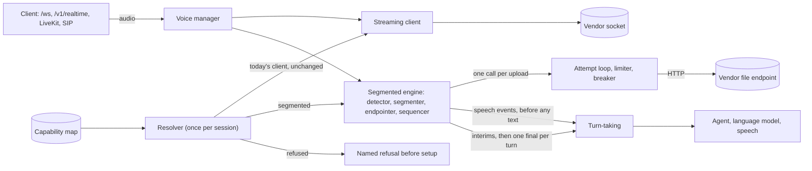

# Segmented speech-to-text: end-to-end plan

**Status:** plan for review, no code written. **Date:** 2026-10-04. **Based on:** `main` at `1b26ec84` (identical to the remote `main` on this date).
**For:** the WaaV gateway team and the Bud platform team.

This is the top-level plan. Seven chapters under `docs/segmented-stt/` carry the detail for each part, and the capability map (the "mapper config") is under `docs/segmented-stt/capability-map/`. Section 19 lists every file.

---

## 1. What this is about

WaaV is the voice gateway: it takes a caller's audio, turns it into text (speech-to-text), hands the text to an agent or language model, and speaks the reply. Speech-to-text models come in two kinds. A *streaming* model accepts audio continuously over a socket and returns text while the caller is still speaking. A *file-only* model accepts one finished audio file per request and returns its text afterwards.

A live call has no finished file, so today a file-only model cannot serve a call. A Bud voice agent that picked ElevenLabs `scribe_v2` failed before any audio flowed. OpenAI's and Groq's Whisper models start a call and then return nothing until the caller hangs up. Self-hosted Whisper servers are refused outright.

*Segmented speech-to-text* is the established answer: the gateway listens with its own voice detector, cuts the caller's audio into utterances at pauses, uploads each utterance as a small file, and feeds the returned text to turn-taking (the logic that decides when the caller has finished and the agent may speak). The requirement from the product side is that the customer never has to know which kind of model they chose: the same request must work for every provider and model, and the gateway does all the mapping.

### Terms used in this plan

| Term | Meaning |
| --- | --- |
| Segment, cut | A *segment* is one stretch of caller speech; the *cut* is the moment the gateway closes it, 224 ms into a pause |
| Upload unit | The audio sent as one file: one segment, or several segments of one turn joined |
| Turn | Everything the caller says before the gateway judges they have finished |
| End-of-turn model | SmartTurn (judges from audio) and the existing text model (judges from the transcript) |
| Resolver | The code that reads the capability map once per session and decides how the model is reached |
| Capability row | The map's entry for one provider and model (or model pattern) |
| Rollout switch, allow-list, covered | The server setting `WAAV_SEGMENTED_STT` (`off`, `allowlist`, `on`). A session is *covered* when the switch lets the new engine serve it |
| Commit transport | A vendor socket that receives audio continuously and transcribes when the gateway's detector sends a "commit" at the end of an utterance |
| Golden recording | A recorded session whose messages a test compares byte for byte |
| Voice agent, conversation loop, plain session | A *voice agent* is a Bud agent spoken to over `/ws` or `/v1/realtime`; the *conversation loop* is the gateway's own speech-to-language-model loop; a *plain* `/ws` session has neither and the client consumes transcripts itself |
| Buffering client | Today's client for some file-only models: it holds all audio and uploads only when the client sends `audio_end` or hangs up |
| Segment success | The share of upload units that return a transcript (empty counts as success) within their deadline; units refused by the rate limiter count as failures |

## 2. The short version

1. **One new engine makes a file-only model look like a streaming vendor.** It owns a voice detector, cuts audio at pauses, uploads each piece, puts the text back in order, and decides when the caller's turn is over. The rest of the gateway receives the same result type it receives today.
2. **One table decides how each model is reached.** The capability map has a row per provider and model saying whether to use today's streaming client, the new upload path, or (later) a socket on which the gateway says where each utterance ends. A resolver reads it once per session, before anything is built.
3. **The customer's request does not change.** The gateway reports what the session got in a new `stt` object inside the existing `ready` message. Everything else is additive.
4. **Streaming models keep today's client.** Recorded "golden" sessions prove the messages unchanged byte for byte wherever the rollout switch does not cover the session. Where it does, the only difference is the additive `stt` key in `ready` (allow-listed deployments from Release 1, every session from Release 3). Three further changes to streaming sessions are deliberate, each behind its own flag with a release note (section 14, item 18).
5. **Seven releases.** Release 0 replaces today's silent failures with a clear, named refusal. Release 1 delivers working calls on OpenAI, Groq, ElevenLabs `scribe_v2`, self-hosted servers and Azure OpenAI behind an allow-list. Release 3 turns it on by default. One item has a hard date: today the gateway's OpenAI client defaults to `whisper-1`, which OpenAI removes on **26 February 2027** (section 3.4), so the switch of that default to `gpt-transcribe` ships with Release 1 or earlier as a standalone change. Release 4, which adds OpenAI's live-only models, targets the same date; section 10.3 gives the schedule.
6. **Expected speed.** From the end of the caller's speech to the final transcript: about 0.8 to 1.4 seconds typically when the end-of-turn model judges the caller finished (an estimate; no vendor publishes a median). For comparison, the published 99th percentiles for streaming models are 0.35 to 0.45 seconds. In that case the gateway adds only the 224 ms pause before the cut, because the upload starts at the pause while the end-of-turn decision runs alongside it. When no model says "finished", the turn ends at the 1.5-second silence ceiling, so the final arrives at the later of about 1.5 seconds and the transcript; that case is rated likely and is measured in Release 2 (section 8).
7. **The brief understated the work.** Its sentence "the rest of the pipeline does not change" is wrong in four places (section 3.5). Interruption, turn-ending, metering and the realtime event stream all assume a streaming vendor today.

## 3. What we found

### 3.1 In the code

Twelve readers each took one area of the gateway; the most surprising claims were re-read by the plan's author. All line references are to `gateway/src` at `1b26ec84`.

| Finding | Evidence | Consequence |
| --- | --- | --- |
| Every live session builds its speech-to-text client in one place | `core/voice_manager/manager.rs:197-205`, called from `handlers/ws/config_handler.rs:1988` | One selection point serves `/ws`, `/v1/realtime` voice agents, LiveKit, SIP and DAG pipelines on a live session |
| The code already says the route, not the model, chooses the transport | `core/stt/standard.rs:480-490`, pinned by tests at `:949-1000` | Add a third factory for live sessions; never edit the existing two |
| Turns end on a flag driven by timers that count from when text arrives | `core/voice_manager/stt_result.rs:152-177`, `:236-251`; `core/turn/strategies/legacy.rs:57-70` | Text arriving 1 to 2 seconds late would split or stall turns unless the engine ends turns itself |
| Interruption is triggered by transcript text | `core/turn/strategies/legacy.rs:21-34`; `core/turn/signal.rs:11-41` has no voice-activity signal | On this path interruption must come from the detector, which needs new plumbing |
| There is no always-on voice detector and no "speech started / stopped" event | Feature-gated and opt-in per session, `config_handler.rs:1953-1983`; transitions discarded at `core/smart_turn/processor.rs:659` | The engine must own its detector |
| SmartTurn (the model that judges whether the caller has finished a thought) very probably never runs on live audio | Its audio window is rebuilt from a buffer trimmed to 400 samples every call, `core/smart_turn/mel_extractor.rs:411-432`; with 20 ms packets it never reaches its 50-frame minimum | An existing defect, independent of this feature. The engine asks the model on demand instead. A confirming test is the first task of Release 0 |
| There is no recovery from a false interruption | `core/agent/engine.rs:613-630` is one-way; the agent's settings for it are parsed and never read | New work, scheduled for Release 6 |
| Self-hosted and Azure OpenAI transcription deployments are refused before any client is built | `handlers/ws/bud_legs.rs:122-134` and `:815-826` | Both sites become a call to the resolver |
| The clients' "upload on silence" mode is dead code | No configuration path sets it | It is removed, not reused |
| File transcription is implemented four separate times | `core/stt/batch.rs`, `core/stt/prerecorded.rs`, the OpenAI and Groq clients, and the self-hosted and Azure OpenAI functions in `handlers/transcribe.rs:769-1027` | The OpenAI, Groq and prerecorded clients are tied to one session and cannot have two uploads in flight; the self-hosted and Azure OpenAI functions are reusable single requests. The shared pieces are extracted into one transcriber layer |
| The audio handed to speech-to-text is at the caller's rate (8 to 48 kHz) | `manager.rs:636-639` | The engine resamples to 16 kHz itself |
| Metering bills every inbound byte | `bud_legs.rs:391-586` | A segmented session would be billed for silence; it must bill uploaded seconds |

### 3.2 Across the vendors

Each of the gateway's 31 speech-to-text vendors was audited twice: once by an agent that read our client code and the vendor's current documentation, then by a fact-checker that tried to refute the result. The fact-checkers made 146 corrections and overturned two verdicts.

| Outcome | Vendors | Count |
| --- | --- | --- |
| Segmentation needed for every model the gateway can reach | Groq, Bhashini, FPT.AI, SberDevices, Phonexia, NECTEC (one model) | 6 |
| Needed for some models | OpenAI, ElevenLabs, Deepgram (hosted Whisper), AssemblyAI, Microsoft Azure, Google, Speechmatics, Gladia, Alibaba, Tencent, Huawei, Baidu, NAVER, Yandex | 14 |
| Useful only as an optional fallback | Cartesia, Sarvam, IBM Watson, AmiVoice, Reverie, Tinkoff, Viettel, and Gnani once it has a working streaming client | 8 |
| Not needed | Amazon Transcribe, Rev AI, iFlytek | 3 |

Four situations exist, and a yes-or-no "can it stream" flag cannot express them:

- **The model is file-only and the vendor answers in one request.** This is the core case: OpenAI's file models, Groq, ElevenLabs `scribe_v2`, Deepgram's hosted Whisper, and others.
- **The vendor streams, but the gateway only has a client that buffers the whole call.** Yandex, SberDevices, NAVER, Bhashini, FPT.AI, Viettel and Gnani. Segmentation is the fastest way to make calls work on them.
- **The vendor's only file interface is a background job that takes tens of seconds.** Amazon Transcribe, Rev AI, iFlytek, Gladia `solaria-3`, AssemblyAI `universal-2`. These cannot be segmented and are refused by name.
- **The model is live-only but expects the caller's side to say where an utterance ends.** OpenAI's two newest models and Cartesia's manual mode. They need the same gateway detector, sending a "commit" message on a socket instead of uploading a file.

### 3.3 In other frameworks

LiveKit and Pipecat, the two open-source frameworks that segment, were read at source level. Both upload strictly one segment at a time, never split long speech, and never account for uploads still in flight. Both have open reports of conversations stalling or one sentence becoming two turns because a per-segment result was treated as the end of the caller's turn. The brief's requirements (parallel uploads, ordering, "do not end the turn while an upload is in flight") therefore have no reference implementation, so this plan specifies that logic precisely and tests it first.

Two measured results shaped the defaults. Pipecat found that appending 0.3 to 2 seconds of silence removes invented words at the start of a transcript and lost words at the end, and that keeping only 0.4 seconds of audio before the "speech confirmed" event cut the first word on every clip. Both were measured on one local model, so they are re-measured per vendor in Release 2.

### 3.4 OpenAI's line-up changed

According to OpenAI's documentation as fetched and fact-checked on 2026-10-03: `whisper-1`, `gpt-4o-transcribe`, `gpt-4o-mini-transcribe` and the diarizing variant were deprecated on 2026-08-26 and are removed on **2027-02-26**. The recommended file model is `gpt-transcribe`, which names its language and vocabulary fields differently and returns no confidence signal. The recommended live models (`gpt-live-transcribe`, `gpt-realtime-whisper`) do not detect the end of speech themselves. All three model identifiers in the gateway's OpenAI client today are in the removed set, and its default is `whisper-1`.

### 3.5 Where the brief is wrong

| The brief says | The code says |
| --- | --- |
| "The rest of the pipeline does not change" | Turn-ending, interruption, metering and realtime events all change |
| "With the VAD it already runs" | No detector runs unless the session opted in and the build includes it |
| "SmartTurn decides the turn"; "keep the 3 s cap" | SmartTurn ends no turn today; the cap in code is 2,000 ms |
| "Keep false-interruption recovery" | None exists |
| "Wrap the existing batch builders" | There is no builder for Groq, self-hosted or Azure OpenAI |
| "Retry once through the existing breaker" | The breaker has no retry; Groq's client has its own three-attempt, 120-second loop |
| "OnSilence works, crudely" | It cannot be switched on |
| "Capabilities endpoint, per deployment" | The existing endpoints are static and per provider; Bud's backend cannot call the gateway |

## 4. The design

### 4.1 The parts



| Part | What it is | Chapter |
| --- | --- | --- |
| Segmented session engine | Detector, segmenter, end-of-turn decision, ordered release of results. Implements the existing `BaseSTT` trait | [1](docs/segmented-stt/chapter-1-segmenter-and-adapter.md) |
| Transcriber layer | One interface for "transcribe this utterance", one implementation per request format, one loop that sends at most two requests per utterance | [2](docs/segmented-stt/chapter-2-transcriber-layer.md) |
| Capability map and resolver | The table, the lookup rules, the third factory, Bud deployment integration | [3](docs/segmented-stt/chapter-3-capability-map-and-resolution.md) |
| Turn-taking and interruption | Detector-driven interruption, lost-turn handling, realtime events | [4](docs/segmented-stt/chapter-4-turn-taking-and-interruption.md) |
| Customer contract | Wire messages, codes, software development kits, documentation | [5](docs/segmented-stt/chapter-5-customer-contract.md) |
| Real-time performance | Time limits, latency measurement, tiers | [6](docs/segmented-stt/chapter-6-realtime-performance.md) |
| Cost, limits, observability, tests, rollout | Limiter, metering, metrics, test plan, releases | [7](docs/segmented-stt/chapter-7-cost-observability-tests-rollout.md) |

Where the chapters disagreed with each other, the binding answers are in [`docs/segmented-stt/INTEGRATION_DECISIONS.md`](docs/segmented-stt/INTEGRATION_DECISIONS.md). That file wins over any chapter, and its later addenda win over its earlier sections.

### 4.2 One caller turn, step by step

A caller says a 3-second sentence to an agent whose speech-to-text deployment is ElevenLabs `scribe_v2`. Times are milliseconds from the caller's first sound.

| Time | What happens |
| --- | --- |
| 224 | The detector has heard seven consecutive speech frames (32 ms each). Speech is confirmed. A segment opens, starting 400 ms before the first speech frame so the first word is not clipped. A spare connection to the vendor is opened if the pool is short |
| 3,008 | The caller stops |
| 3,232 | 224 ms of silence: the segment is cut. 500 ms of digital silence is appended, the audio is wrapped as a 16 kHz WAV file and the upload starts. In parallel the end-of-turn model is asked once whether the caller sounds finished |
| about 3,280 | The model says "finished". The turn now waits only for the text |
| about 4,000 | The vendor answers. The engine emits exactly one result that is both final and end-of-turn, carrying the whole turn's text. The agent starts its reply |

If the caller had paused mid-sentence and continued, the first segment's text would have been sent as an interim result and the turn would have stayed open until the second segment returned. If the vendor had not answered, a second request would have started at about 5,740 on a fresh connection, and the utterance would have been given up 6,000 ms after the cut, with a warning to the client and a spoken fallback from the agent.

### 4.3 Why the existing turn timers are safe

The voice manager arms its 600 ms and 1,500 ms timers only for a result that is final but not end-of-turn (`core/voice_manager/stt_result.rs:171-173`, re-read for this plan). The engine never emits that shape: it sends interim results, then one result that is final and end-of-turn together. So the result processor is not edited, and a late second segment cannot be cut off by a timer. A unit test pins the rule.

## 5. What the customer sees

The request is the same for every model. This is the whole contract, stated as rules a test can check:

1. The same speech-to-text configuration is accepted for every provider and model. The session is either served (streaming or segmented) or refused at setup under rule 4, for example on a retired model or one whose only file interface is a slow background job.
2. The session is told what it got, once, in `ready.stt`: whether transcription is `streaming` or `segmented`, what kind of interim results to expect, who decides the end of an utterance, the expected latency and its basis, and any notices.
3. Each caller turn produces exactly one final end-of-turn transcript. The `stt_result` message shape does not change.
4. A session that cannot be served is refused at setup with a code and a reason, never left silent.
5. A session on a streaming model takes today's path through today's client. Where the rollout switch does not cover it, its messages match today's golden recordings byte for byte. Where the switch covers it (allow-listed deployments from Release 1, every session from Release 3), the only difference is the additive `stt` key in `ready`, plus the three flag-gated changes of section 14, item 18 when their flags are on.

Example: a client sends its usual configuration with `"provider": "elevenlabs", "model": "scribe_v2"`. Today setup fails. From Release 1 it receives:

```json
{"type":"ready","protocol_version":"1.0","stream_id":"…","stt":{"provider":"elevenlabs",
 "model":"scribe_v2","transcription_mode":"segmented","interim_results":"per_segment",
 "endpointing":"gateway","speech_events":"detector","detector":"silero",
 "confidence_source":"vendor","latency_class":"slow","final_latency_slow_ms":2010,
 "final_latency_slow_percentile":99,"latency_basis":"seed","final_deadline_ms":6000,
 "streaming_alternatives":["scribe_v2_realtime"]}}
```

`final_deadline_ms` is the longest the gateway waits for a transcript, counted from the cut (the moment `speech_end` is sent). Every field and code is defined in [`docs/segmented-stt/customer-contract-reference.md`](docs/segmented-stt/customer-contract-reference.md).

What is new on the wire, all optional or additive: the `stt` object in `ready`; `vad_event` messages (speech start and end from the detector, and the gateway's turn decisions) for clients that ask for them; `stt_warning` for a problem that does not end the call; `code`, `recoverable` and `details` on `error`; and one optional preference, `transcription_mode` (`auto`, `streaming`, `segmented`; on the wire from Release 2). Only a request that says `streaming` can be refused for getting a segmented model.

Two behaviours depend on what kind of session it is. A plain `/ws` session, or a conversation loop with turn detection switched off, on a model whose today client buffers until `audio_end` (OpenAI and Groq file models, and four regional vendors) keeps that client even when covered, because its client ends its own turns and the gateway must not start ending them without consent; `ready.stt` then reports `transcription_mode: buffered`. It moves to the engine only if it sets `transcription_mode: segmented`. And a segmented session with no language gets the notice `stt_language_unset`, because file models guess the language poorly on short clips. On the OpenAI-Realtime-compatible surface the same facts arrive as `bud.session.stt` and `bud.session.warning` events.

Existing settings on a segmented session are honoured, mapped or ignored with one coded warning. For example `endpointing_ms` sets the shortest silence after which the turn may end, but never the 224 ms pause at which audio is cut, so a small value tuned for a streaming vendor cannot multiply uploads.

Detail, codes and software-development-kit changes: [chapter 5](docs/segmented-stt/chapter-5-customer-contract.md).

## 6. The capability map (the "mapper config")

**What it is.** A JSON data file with one row per provider and model (or model pattern). A row lists the ways the gateway can reach that model on a live call, in order of preference: today's streaming client, a file upload per utterance, or a socket on which the gateway sends the commit. For each way it records the release from which it is enabled, the honest state of the gateway code today, limits, billing rules, the exact request dialect (for example whether the language field is `language` or `languages[]`), a latency starting value, and where every fact came from.

**How it is used.** The resolver normalises the provider and model, finds the row (deployment override, then exact model, then pattern, then provider default, then global default), and picks the first way that is enabled and allowed. An unknown model of a known provider falls to that provider's default row and the session is told the capability was assumed. An unknown provider takes today's path unchanged.

**Where it is.**

| File | What it is |
| --- | --- |
| `docs/segmented-stt/capability-map/rows/<provider>.json` | The source: one file per provider (35 files, 412 rows), each fact with its sources and what is unverified |
| `docs/segmented-stt/capability-map/meta.json`, `profiles.json` | Map version and latency classes; twelve named transport profiles a deployment may select (for example a vLLM or NVIDIA NIM realtime socket) |
| `docs/segmented-stt/capability-map/assemble.py` | Builds the assembled map from the source files |
| `docs/segmented-stt/capability-map/stt_live_capabilities.json` | The assembled map (generated) |
| `docs/segmented-stt/capability-map/stt_capability_map.schema.json` | The schema (version 2) |
| `docs/segmented-stt/capability-map/validate_rows.py` | Validator for one file or the whole set |
| `docs/segmented-stt/capability-map/resolve.py` | Reference resolver in Python with a self-test: the executable specification for the Rust resolver |
| `docs/segmented-stt/capability-map/EXPECTED_RESOLUTION.md` | What every provider and model gets in each release, generated by the reference resolver |
| `docs/segmented-stt/capability-map/CAPABILITY_MATRIX.md` | The same information for people |

**What it says, release by release.** Generated by the reference resolver over all 412 rows, for a voice agent with automatic turn detection (the strictest case). Manual-mode agents, conversation loops, DAG sessions and plain `/ws` sessions have their own columns in `EXPECTED_RESOLUTION.md`. A row is one model or one model pattern.

| Release | Today's client, unchanged | Upload per utterance | Gateway-driven commit | Refused with a named reason |
| --- | --- | --- | --- | --- |
| 0 | 297 | 0 | 0 | 115 |
| 1 and 2 | 297 | 29 | 0 | 86 |
| 3 | 266 | 39 | 0 | 107 |
| 4 | 261 | 39 | 11 | 101 |
| 5 and 6 | 205 | 135 | 11 | 61 |

How to read it:

- **Release 0** refuses only what the map records as unable to work today (the field `when_unusable.today`, taken from reading code, not from running it), plus, by deliberate choice, `/ws` voice agents with automatic turns on a buffering client (section 14, item 3). `python3 resolve.py --check-release-0` lists every Release 0 refusal with its justification and fails if any is unjustified; today it reports 168 row-and-session pairs that fail today, 72 refused at setup today, 9 retired, and 32 voice agents on buffering clients.
- **Release 3** refuses more, because models that today's clients silently replace with a different model (for example AssemblyAI `universal-2`, retired Baidu and Azure models) are warned until then and refused from Release 3.
- **The 61 rows still refused in Release 5**: 39 whose only file interface is a background job, 9 retired models, 11 that no release of this plan builds a client for (listed in section 7), and 2 served only on interfaces the gateway does not use (Rev AI `human`, Sarvam `saaras:v2.5`).
- **Release 5 figures assume each vendor passes its live probe.** Counting only evidence the map holds today gives 44 uploads instead of 135.

**Refusal reasons.** A row stores one of five reasons (`async_only`, `client_not_implemented`, `disabled`, `provider_not_built`, `model_not_served`). The resolver adds three that depend on the session (`not_covered_yet`, `language_not_live`, `realtime_needs_agent`). `not_covered_yet` is used only when the rollout switch is what stands in the way, so only then does the message suggest asking the operator; `client_not_implemented` means the gateway has no client for the model in this release, and the map says whether a later release adds one. All eight are defined in the contract reference.

**Latency tier.** A deployment can set `latency_tier: low_latency` (read from Release 4). The resolver then prefers a commit transport over a file upload when a row has both; this is how `gpt-transcribe` reaches OpenAI's socket.

**Known limits of the map.** A language or region constraint carries no release of its own, so the resolver applies constraints on today's clients from Release 3, as addendum A7 places the refusal of batch-only languages. Vendor limits that differ by plan record the lowest paid plan; a deployment can override them. Most file endpoints publish no latency, so their rows start in the "unknown" class until Release 2 measures them. About 30 exact rows whose streaming client silently runs a different model (for example a Tencent Spanish engine served as Mandarin) are recorded in notes but do not yet raise the substitution warning; that needs a per-transport field.

**Size.** With every source and note, the assembled map is about 3 MB. `assemble.py --routing` writes the routing map the gateway embeds, without the reviewer prose: about 1.0 MB, 45 KB compressed, validated at start-up. `resolve.py --expected-json` writes the expected outcome of every row in every release, which a gateway test compares against the Rust resolver. The sources stay in the repository for reviewers and for the drift job. The same file is what Bud mirrors. Keeping it correct is part of the plan: schema and consistency checks on every pull request, a scheduled job that re-reads vendor documentation and opens an issue on drift, live probes with real keys, and lifecycle dates on every row so a retirement such as OpenAI's is a warning months ahead and a named refusal on the day.

Detail: [chapter 3](docs/segmented-stt/chapter-3-capability-map-and-resolution.md).

## 7. Every vendor's outcome

| Release | Becomes usable on live calls | How |
| --- | --- | --- |
| 1 | OpenAI file models (`gpt-transcribe`, and `whisper-1` and `gpt-4o-*transcribe*` until their removal); Groq `whisper-large-v3` and `-turbo`; ElevenLabs `scribe_v2` and `scribe_v2_medical`; self-hosted OpenAI-compatible servers (vLLM, speaches, whisper.cpp and similar); WaaV Infer; Azure OpenAI file models | Upload per utterance. Azure OpenAI at its default quota of three requests a minute uploads once per turn; its capacity warning arrives in Release 2 |
| 3 | AssemblyAI's synchronous endpoint; Deepgram's hosted Whisper models | Upload per utterance |
| 4 | OpenAI and Azure OpenAI `gpt-live-transcribe` and `gpt-realtime-whisper` (Azure after a live probe); `gpt-transcribe` on OpenAI's socket for deployments that set the low-latency tier; Cartesia manual finalize, behind its own flag | The same engine drives a commit on the vendor's socket |
| 5 | Azure Speech fast transcription; Google `Recognize` (including `chirp_2` in languages it cannot stream); Speechmatics `melia-1` and `oak-1`; Yandex; SberDevices; NAVER CLOVA; Bhashini; FPT.AI; Gnani; NECTEC `partii4`; Alibaba, Tencent, Huawei and Baidu file models; Phonexia | Upload per utterance through one generic adapter. Each row is switched on only after a live test with a real key. Viettel only if a measurement contradicts the 15 to 30 seconds the audit observed |
| Never: slow jobs only | Amazon Transcribe batch-only languages, Rev AI and iFlytek file products, Gladia `solaria-3`, AssemblyAI `universal-2` | The only file interface is a slow background job. Refused at setup with `stt_live_unsupported` |
| Not in this plan | NAVER CLOVA Speech short, long and streaming (`csr` is served from Release 5); Huawei `chinese_16k_conversation`; Speechmatics `linden-1`; self-hosted Kyutai models; Deepgram Flux; ElevenLabs realtime ids the gateway does not know; Rev AI `human`; Sarvam `saaras:v2.5` | No gateway client for the interface that serves them. Refused by name with the reason; each is a candidate for later work |

Every model that streams today keeps today's client in every release.

Until its release arrives, a model in this table gets what works today, from Release 0 onwards:

- **Buffering models** (OpenAI and Groq file models, Bhashini, FPT.AI, NAVER `csr`, NECTEC `partii4`): today's only client holds the audio until `audio_end` or hang-up. A voice agent whose turn detection is automatic is refused (`stt_live_unsupported`). Every other session keeps today's client and receives `stt_buffered_until_commit`, saying text arrives when the client sends `audio_end`.
- **Models with no working client today** (ElevenLabs `scribe_v2`, Deepgram hosted Whisper, Speechmatics `melia-1` and `oak-1`, WaaV Infer, Phonexia, Alibaba file models, Viettel): refused on every session, as today's code already fails or refuses them.
- **OpenAI live-only models**: refused on every session until Release 4; today's client sends them to a file endpoint that rejects them.
- **Self-hosted and Azure OpenAI deployments**: keep today's refusal codes (`stt_not_streaming`, `unsupported_deployment`) until covered.
- **Yandex and SberDevices**: keep today's timed-upload client, reported as known broken.
- **Models today's client silently replaces with another model**: kept and warned until Release 3, then refused.

## 8. Using it in real time

**The budget for one turn**, from the end of the caller's speech:

| Stage | Time | Basis |
| --- | --- | --- |
| Pause detection before the cut | 224 ms | Design value |
| Upload and transcription | about 0.6 to 1.2 s typical. Published 99th percentiles: 0.65 s AssemblyAI synchronous, 1.54 s Groq, 2.01 s OpenAI `gpt-4o-mini-transcribe` and ElevenLabs; none for `gpt-transcribe`, the recommended OpenAI default, which starts unmeasured | Typical is an estimate; the percentiles are Pipecat's, measured in February 2026 with a 200 ms pause and without the padding this plan adds |
| End-of-turn decision | runs alongside the upload; adds nothing when a model says "finished"; ends at the 1,500 ms silence ceiling when none does | Design |
| Language model, to first spoken token | about 0.3 s for a non-reasoning streaming model | The gateway's latency harness assumes 300 ms. The June 2026 measurement of 235 ms (`LATENCY_ANALYSIS.md`) was a reasoning model's first token; that model then took 1 to 4 s to say anything |
| Text-to-speech, to first audio | 0.7 to 0.9 s with the vendors measured in June 2026; 0.07 to 0.2 s with a fast streaming one | `LATENCY_ANALYSIS.md` |
| **End of speech to first agent audio, model says "finished"** | **about 1.8 to 2.6 s** with today's measured text-to-speech; about 1.2 to 1.8 s with a fast streaming one | Computed from the rows above |
| **Same, no model says "finished"** | **about 2.5 to 2.7 s**: the 1.5 s ceiling, then the language model and speech | Computed |

For comparison, a streaming speech-to-text model finalizes in about 0.42 s on this gateway (measured in June 2026), so the same agent answers about 1.4 to 1.6 s after the end of speech. On a row that uploads once per turn (Azure OpenAI at its default quota) the upload waits for the end-of-turn decision, and a wrong "not finished" costs about 3.3 s.

**What is on for everyone (standard tier).** Upload at the pause, not at the end of the turn. Up to two uploads in flight. Connections kept warm to the depth the session may need, topped up when the caller starts speaking (a cold connection measured 100 to 440 ms). 16 kHz mono WAV: Groq and ElevenLabs both state that uncompressed audio gives the lowest latency. The language always sent when known. One function computes every time limit; a second request is sent beside a stalled first one at about 2.5 seconds, and an utterance is given up at 6 seconds.

**What does not help.** No lever on the gateway side makes the final transcript arrive earlier than one request sent at the first pause on a warm connection to a nearby region. Re-uploading a growing window buys interim text only, at roughly (n+1)/2 times the billed audio. Streamed text output from an uploaded file ends when the plain response would.

**What does help, later.** Release 4 adds the commit transport: the audio streams to the vendor's socket while the caller speaks and the gateway's detector says where the utterance ends. Pipecat's published figures for an OpenAI file-class model on that socket are a 0.64 s median and a 1.66 s 99th percentile, against a 2.01 s 99th percentile for file upload (measured on a different OpenAI model, so the comparison is indicative only). Release 4 also adds the low-latency tier, set per deployment: it routes a model to the commit transport where the row has one (for example `gpt-transcribe`) and sends a hedged second request early. Release 6 adds interim text by re-decoding for self-hosted models, where the cost is our own compute.

**Masking the wait.** From Release 2 the agent can speak a short holding phrase when the transcript is late, timed from the end of the caller's speech.

**Telling the customer.** Each row has a latency class (realtime up to 600 ms, fast up to 1,200 ms, slow above). The session start message carries it, and Bud labels a slow deployment "slower on calls". Where the same provider has a streaming model, the message names it.

Detail: [chapter 6](docs/segmented-stt/chapter-6-realtime-performance.md).

## 9. Cost and behaviour under load

Request rate, not price, is the limit that binds first. Two hundred concurrent calls at three uploads per turn is 3,000 requests a minute; Groq's base limit is 400 and OpenAI's first tier is 500.

| | One upload per pause | One upload per turn |
| --- | --- | --- |
| Calls one Groq key carries (80% of 400 a minute) | 21 | 64 |
| Calls one OpenAI first-tier key carries (80% of 500 a minute) | 26 | 80 |
| Groq's bill per call-hour (10-second minimum per request) | $0.100 | $0.033 |
| Charged to the customer at uploaded seconds, Groq | $0.030 | $0.026 |

A limiter per vendor host, credential and model keeps uploads under the limit. When an upload at a pause cannot start at once, the audio is held and joined, and goes up as one upload when the turn closes, so between 21 and 64 calls on one Groq key the gateway slides smoothly from three uploads a turn to one without losing a turn. Beyond that, the oldest sessions keep working and new ones are warned and, from Release 3, refused at setup.

The customer is charged for seconds actually uploaded. The vendor's own bill, including any per-request minimum, is recorded beside it on every row, failed ones included. A talkative caller on a segmented model is charged up to about 1.5 times the streamed seconds, because each upload carries about 1.1 seconds of padding. On Groq the vendor's own bill per call-hour is several times what the customer is charged at uploaded seconds; the deployment's price must reflect the vendor's minimum (Release 5) or Bud absorbs the difference.

A vendor receives at most two requests per utterance, counted on the wire by a test. A rate-limit answer slows the limiter and never opens the circuit breaker, because the breaker is shared by every tenant. Upload breakers are separate from the same vendor's streaming breaker.

Detail: [chapter 7](docs/segmented-stt/chapter-7-cost-observability-tests-rollout.md).

## 10. Releases

| Release | Delivers | Entry or exit condition |
| --- | --- | --- |
| **0. Groundwork and honest refusal** | Test kit (fake transcriber, scripted detector, deterministic clock, mock vendor server). Golden recordings of streaming sessions, and of push-to-talk sessions on the OpenAI and Groq clients against the mock vendor, because Release 1 moves shared code out of those clients and those sessions keep using them. The confirming tests: SmartTurn on small packets, and a transcript at every `audio_end` on the OpenAI and Groq clients, with the fix for both if they fail (addendum B5). A gateway `test-util` feature for deterministic test time; tests that need the real detector models run in the accuracy job. The capability map, schema and resolver, used only to refuse or warn. A named refusal replaces today's silent failure for voice agents; other sessions on a buffering model get a warning. The detector model baked into the production image. Bud: catalog entry for `scribe_v2_realtime`; playground message | Exit: streaming sessions identical to the golden recordings; `resolve.py --check-release-0` passes |
| **1. First working calls** | Behind an allow-list. The engine; the OpenAI-compatible and ElevenLabs transcribers with the one attempt loop; the resolver wired into session setup and both Bud refusal sites; detector-driven interruption and lost-turn handling for voice agents; `ready.stt` with the `stt_language_unset` notice; uploaded-seconds metering; the limiter. **Dated item, must ship before 2027-02-26, may ship earlier as a standalone change:** OpenAI's default model becomes `gpt-transcribe`, with its `languages[]` and `keywords[]` fields | Entry: every replica reports the detector model loaded. Exit: live `/ws` calls on ElevenLabs `scribe_v2` and OpenAI `gpt-transcribe`; streaming sessions identical to the golden recordings |
| **2. Dark launch complete** | Setup probe; per-deployment capability record for Bud; conversation loop; realtime events timed by the detector; holding phrase; session language vote; Azure OpenAI capacity warning; a control record that can switch a row off on a running gateway; measured latency; software development kits and the `transcription_mode` wire field | Exit: 3,000-sample latency measurement per Release 1 vendor; billing probes; one live SIP call |
| **3. Default on** | Switch default on; Bud's "slower on calls" label; analytics columns; drift job; dead flush code removed; AssemblyAI synchronous endpoint and Deepgram hosted Whisper | Entry: a week of staging traffic at 99.5% segment success |
| **4. Live-only models and low latency** | The commit transport for OpenAI and Azure OpenAI live-only models and Cartesia (Cartesia behind `WAAV_STT_CARTESIA_MANUAL_FINALIZE`); hedged requests; the low-latency tier | Target: before 2027-02-26. It depends only on Release 1, so it can be built alongside Releases 2 and 3 |
| **5. Wider vendors and hardening** | Third vendor wave; fallback to a second vendor; retention and region options | Each vendor row enabled only after a live probe |
| **6. Interruption recovery and interim text** | Pause, then commit or resume after a false interruption (LiveKit and `/ws` clients that declare support); interim text for self-hosted models | |

### 10.1 Order of work inside Release 0 and Release 1

Several files are touched by many parts: `handlers/ws/config_handler.rs` by six, `handlers/ws/bud_legs.rs` and `core/voice_manager/manager.rs` by five. The order below sequences those edits so each step compiles, is testable alone, and leaves streaming sessions identical to the golden recordings. It is the author's synthesis of the seven change lists.

**Release 0**

1. Test kit, golden recordings (streaming sessions, and push-to-talk sessions on the OpenAI and Groq clients), the confirming tests, and the `segmented_stt_ws` integration binary for tests over a real socket. No production code.
2. The capability map files, schema, and the pure resolver with its tests. No call sites.
3. Optional `code`, `recoverable` and `details` on the `error` message.
4. The resolver wired into the two `bud_legs` sites and the plain `/ws` path, to refuse or warn only.
5. The detector and end-of-turn model files in the production image.
6. Metric series registered at zero.

**Release 1**

1. `core/stt/base.rs`: five defaulted trait methods and one optional result field. No behaviour.
2. Transcriber layer: lift the shared pure functions; the transcriber interface; the attempt loop; the breaker repairs; the upload clients. Testable alone against the mock vendor.
3. Limiter, upload adapter and metering objects, against that loop.
4. Time limits from seeded values.
5. The engine, first against the fake transcriber, then the real loop.
6. Process-wide and per-session values; the third factory; the single edit to `VoiceManager::new`; the `finalize_stt` change.
7. `initialize_voice_manager`, as one coordinated change in this order: resolution, session objects and meter mode, no second detector, `ready.stt`.
8. `bud_legs.rs`: refusals replaced by the resolver, trusted base address, segmented metering mode, agent turn-detection mapping.
9. Voice-manager dispatcher for speech events and outcomes; new controller signals and start strategy; the agent loop.
10. Wire messages and codes.
11. Mock-vendor tests over a real socket, then live calls.

### 10.2 Indicative size

These are the author's rough estimates from the change lists, not figures from the designs. They assume engineers who know the gateway.

| Release | Engineer-weeks | Largest items |
| --- | --- | --- |
| 0 | 3 to 4 | Test kit and goldens; map and resolver |
| 1 | 12 to 16 | Engine (4 to 5); transcriber layer (3); turn-taking for agents (2 to 3); resolver wiring and Bud legs (2); limiter and metering (2) |
| 2 | 6 to 8 | Conversation loop and realtime events; latency store and benchmark; probe and publisher |
| 3 | 3 to 4 | Two transcribers; analytics; clean-up |
| 4 | 4 to 6 | Commit transport for two vendors; hedging |
| 5 | 6 to 10 | Depends on how many vendors pass their live probe |
| 6 | 5 to 7 | Agent engine pause and resume |

### 10.3 Path to 26 February 2027

Releases 0 to 4 add up to 28 to 38 engineer-weeks; the plan is dated 4 October 2026, about 21 calendar weeks before the date. One engineer cannot meet it. The proposal below assumes **three gateway engineers** plus part-time Bud support, and is a starting point for planning, not a commitment.

| Item | Proposed window | Depends on |
| --- | --- | --- |
| OpenAI default to `gpt-transcribe` (the hard-dated item) | Standalone change, by end of October 2026 | Sign-off item 5 only |
| Release 0 | 5 to 30 October 2026 | Nothing |
| Release 1 | 2 November to 18 December 2026 | Release 0 |
| Release 4 (commit transport) | 4 January to 5 February 2027, alongside Releases 2 and 3 | Release 1 and the live-audio tap in the engine |
| Release 2 | 4 to 29 January 2027 | Release 1; working vendor keys for the 3,000-sample measurements |
| Release 3 | 1 to 19 February 2027, including a week of staging traffic | Release 2 |

The calendar risks are the year-end break, the live measurements (the ElevenLabs key on the build machine was not working at the last check) and the staging week. If Release 4 slips past the date, customers lose nothing they have today; only the hard-dated default change must not slip.

## 11. Acceptance criteria and the tests that prove them

The brief's five criteria, corrected where the brief was wrong. Test names are from the chapters.

| Criterion | Proved by | Level |
| --- | --- | --- |
| 1. Segments are right and each turn gets exactly one end-of-turn result, after every upload has resolved | `pre_roll_is_measured_back_from_the_first_speech_frame`; `a_segment_under_the_minimum_speech_span_is_discarded_with_an_outcome`; `a_split_shares_the_pause_and_no_speech_sample_is_lost_or_duplicated`; `results_are_released_in_sequence_when_responses_arrive_out_of_order`; `a_turn_does_not_end_while_a_unit_is_held_or_in_flight`; `segmented_result_shapes_arm_no_forced_final_timers` | Unit and in-process |
| 2. Interruption comes from the detector alone; an empty or invented overlap does not cut the agent | `agent_chain_barge_in_fires_before_any_transcript_and_one_reply_follows`; `a_cough_below_the_threshold_never_interrupts_and_leaves_no_open_turn`; `agent_chain_a_cough_rendered_as_thank_you_leaves_the_agent_talking`. Resuming after a false interruption arrives in Release 6 | In-process; mock vendor over a real socket |
| 3. A live `/ws` and `/v1/realtime` call on ElevenLabs `scribe_v2` and an OpenAI file model yields a transcript per utterance and a reply | `ws_segmented_session_yields_a_transcript_and_a_reply`; `cascade_chain_a_segmented_call_produces_a_transcript_and_a_reply`; the DAG and LiveKit chain tests in chapter 4; four key-gated live tests; one live SIP call as a Release 2 exit condition | Mock vendor; live |
| 4. End of speech to final transcript within 2.5 s at the 99th percentile | The gateway's own share is gated in continuous integration: `upload_starts_at_the_cut_without_waiting_for_the_turn_decision`, `the_turn_final_is_emitted_at_the_response_instant`. The vendor's share is measured: at most 20 of 3,000 samples above 2,500 ms | Unit; benchmark |
| 5. Streaming models take today's path | `every_model_that_streams_today_resolves_to_the_native_engine`; `the_live_factory_returns_the_same_client_as_today_for_a_native_resolution`; `streaming_ws_messages_match_the_golden_recording_under_every_switch_value` (byte for byte where the switch does not cover the session; only the `stt` key of `ready` differs where it does); the existing pinned tests in `core/stt/standard.rs` | Unit; golden recordings |

Acceptance tests are library tests that run without the optional detector features, because continuous integration runs only six named integration binaries; Release 0 adds the `segmented_stt_ws` binary for tests over a real socket. Tests that need the real detector model files run in the accuracy job.

## 12. Trade-offs

- **Correct turns over earliest text.** The client sees interim text per returned segment and one final per turn, never a per-segment final. This removes the split-turn failure both frameworks report. The cost: on `/v1/realtime` no text appears until the turn ends.
- **Give up a late transcript rather than deliver it late.** A transcript that misses its 6-second deadline is dropped and reported. Late delivery would attach words to the wrong turn and could repeat an agent's tool call. The cost: words are lost when a vendor is very slow.
- **Refuse rather than degrade when the detector model is missing.** A crude volume-based detector would upload noise and interrupt on noise. The cost: a missing file refuses calls, so the image must carry it.
- **A data file over compiled tables.** One file serves the gateway, Bud and documentation, and a model retirement is a data change. The cost: a schema, a validator and drift checks to maintain.
- **Charge uploaded seconds, not the vendor's bill.** Predictable for the customer. The cost: on a vendor with a per-request minimum the gateway's cost can exceed what it charges unless the price reflects it (Release 5).
- **First release without resuming after a false interruption.** Building pause-and-resume in the agent engine is the largest single item and is not needed for calls to work. The cost: an interruption on noise that passes the 500 ms threshold silences the agent until the caller speaks.
- **Leave plain `/ws` clients on today's client.** A client that ends its own turns with `audio_end` keeps exactly what it has today unless it asks for segmented. The cost: those clients do not get the new engine's per-utterance results automatically.
- **Three vendors first, the rest behind live probes.** A row is only switched on after a real call succeeds. The cost: twelve regional vendors wait until Release 5.

## 13. Risks

| Risk | Likelihood | Effect | Handling |
| --- | --- | --- | --- |
| The end-of-turn model says "not finished" on finished speech | High | Turns wait for the text model or the 1.5 s ceiling | Three-step decision; the share closed by each step is measured in Release 2 and gates Release 3 |
| Vendor request limits at scale | High above about 20 calls per key | Later finals, then lost turns | Limiter, held-and-joined uploads, per-turn rows, refusal of new sessions on measured overload |
| Typical vendor latency is unpublished | Certain | The 0.8 to 1.4 s estimate may be wrong | Measured per vendor in Release 2 before default-on |
| Invented text on noise (Whisper-family models) | Medium | A false turn or interruption | Minimum speech span, energy floor, vendor quality signals where they exist, a tiered phrase filter, and overlap evidence |
| Thresholds untested on 8 kHz telephone audio | Medium | One-word answers dropped or noise uploaded | Real-model tests on telephone audio; measured in Release 2 |
| The OpenAI default change misses 2027-02-26 | Low if scheduled as in section 10.3 | Every OpenAI session that names no model, and the file transcription route, fails on that date | A standalone change with no dependency on later releases |
| Release 4 misses 2027-02-26 | Medium | OpenAI then has no live-text model the gateway can drive; nothing customers have today is lost | Scope it to the commit transport alone if needed; it can be built alongside Releases 2 and 3 |
| The schedule assumes three engineers | Medium | Releases slip past the date | Section 10.3; the hard-dated item is independent of the rest |
| Shared-file edits collide | Medium | Rework | The order in section 10.1; one coordinated change to `initialize_voice_manager` |
| The map goes stale | Certain over time | Wrong routing or a silent slow path | Lifecycle dates, drift job, live probes, fail-slow default, a counter for unknown models |
| Bud-side changes lag the gateway | Medium | Label and settings unavailable | The gateway works without them; section 16 lists what each release needs |

## 14. Decisions that need sign-off

Each has a recommended default so work can start. They are grouped by what they block.

**Before the plan is final**

1. **Scope.** All 20 vendors that need segmentation are placed in a release or refused by name (section 7). Recommended: accept; the Release 5 vendors are each gated on a live probe, and the "Not in this plan" models stay out.
2. **The 2.5-second criterion.** Recommended: a release gate for the Release 1 vendors and a "slow" label on every other row; a vendor measured slower is offered with a warning, not refused.

**Before Release 0**

3. **Sessions the engine does not cover yet.** Recommended: refuse only voice-agent sessions with automatic turn detection on a model whose client buffers until hang-up; warn every other session and leave its behaviour unchanged. On `/v1/realtime` such an agent cannot work today. On `/ws` it is refused by choice: `audio_end` flushes the transcript on every session (`handlers/ws/audio_handler.rs:301-322`), so an agent whose client sends `audio_end` may get a reply today, probably for the first turn only, because the OpenAI and Groq clients drop their callbacks on that flush (addendum B5). Needs confirmation that no voice agent in production works that way. The withdrawal switch `WAAV_STT_FILE_ONLY_REFUSAL=off` removes the refusals; the warning stays.
3a. **Plain `/ws` sessions on a buffering model stay on today's client when covered** unless they ask for segmented (addendum B4). Recommended: accept.
4. **Whether Bud matches on the two existing refusal codes** (`unsupported_deployment`, `stt_not_streaming`). This decides whether they may change.

**Before Release 1**

5. **OpenAI's model when the session names none.** Recommended: `gpt-transcribe`. This decision is on the critical path for the 2027-02-26 date.
6. **Detector model missing on a production build.** Recommended: refuse the session; an operator switch allows the volume-based detector.
7. **The silence ceiling.** Recommended: 1,500 ms, matching the streaming path; an agent's own value honoured between 800 and 3,000 ms. The agent contract publishes 3,000 ms as its default, and today the gateway cannot tell "set" from "default".
8. **A marker for lost words.** Recommended: never in customer-visible text; only in the language model's input.
9. **Ending a voice-only call on the third lost turn in a row**, and the wording of the fallback message.
10. **Launching without resume after a false interruption**, which is not offered on `/v1/realtime` in any release.
11. **A billed setup probe** on hosted vendors for unknown model ids, with up to two seconds of setup wait (Release 2).
12. **Who can set a self-hosted deployment's address in Bud.** If a tenant can, the in-cluster address rule must be an operator allow-list.
13. **Working vendor keys and a gateway near each vendor** for the benchmark and live checks. The ElevenLabs key on the build machine was not working at the last check.
13a. **Cost basis.** Recommended: charge uploaded seconds; the vendor's per-request minimum enters only through the deployment price (Release 5); customer documentation says a talkative caller pays up to about 1.5 times the streamed seconds.
13b. **ElevenLabs vocabulary hints sent as key terms**, which ElevenLabs bills 20% more. Recommended: map them, and warn.
13c. **`protocol_version` stays "1.0"** for the additive `stt` field, against the code's rule to bump the minor version (`handlers/ws/messages.rs:34-36`), because a bump makes deployed TypeScript SDKs warn on every session. Recommended: keep 1.0.
13d. **Which deployments start the Release 1 allow-list.** Recommended: internal Bud agents on ElevenLabs `scribe_v2` and OpenAI `gpt-transcribe`.
13e. **The team and schedule in section 10.3.** Recommended: three gateway engineers.

**Before Release 3**

14. **Refusing new sessions on measured overload** by default, or only warning.
15. **Vendor limit tiers for the keys Bud operates.** Two hundred calls on Groq need a negotiated limit.
16. **Native clients the audits found broken** (section 17): report in `ready.stt`, as planned, or refuse.
17. **Whether `ready.stt` may name the vendor and model** to an agent's end user.
18. **Three deliberate changes to streaming sessions**, each behind its own flag with a release note (the greeting fix needs sign-off before Release 2, when it ships): a fix to greeting interruption in shared agent code (Release 2); speech events derived from transcripts for streaming clients that ask for them (Release 2); and Cartesia sessions moving from today's client to the gateway-driven finalize transport, which fixes today's client ending one utterance several times (Release 4, `WAAV_STT_CARTESIA_MANUAL_FINALIZE`, off until a live probe passes).
18a. **Error-class changes on the file transcription route** when the OpenAI and Groq clients are rewired (chapter 2). Recommended: approve with a release note.
18b. **Seven analytics columns** and whether a cancelled upload gets its own error class (chapter 7). Recommended: seven columns; a cancelled upload stays `internal`.
18c. **Latency class thresholds** of 600 and 1,200 ms behind Bud's "slower on calls" label (chapter 6). Recommended: keep until Release 2 measurements, then recalibrate.

**Later**

19. Whether listing a fallback deployment is consent to send caller audio to a second processor.
20. Who chooses and pays for the low-latency tier.
21. Whether to build gateway-side interim text at all.

## 15. Measurements needed

None of these exists today. Each gates a decision above or a threshold in a chapter.

- Median and 95th percentile from end of speech to final transcript for each hosted file endpoint.
- How often the end-of-turn model says "not finished" on a finished utterance, at a 224 ms pause.
- The rate of empty interruptions at 300, 400 and 500 ms of speech, including on telephone audio.
- Whether 0, 300 or 500 ms of appended silence is best on each hosted model.
- Whether the detector's thresholds keep one-word answers on 8 kHz audio.
- What each vendor bills for a request the gateway abandons.
- HTTP/1.1 against HTTP/2 for 50 concurrent short uploads per vendor host.
- CPU and memory per segmented session at a few hundred concurrent calls.
- The two confirming tests: SmartTurn on small packets, and a second `audio_end` on the OpenAI and Groq clients, including a failed upload on Groq.

## 16. Bud-side work

To be confirmed against a current checkout: the local copy of the Bud repository is from June and lacks the voice-agent code, so Bud files were read from the remote.

| Task | Needed by |
| --- | --- |
| Catalog: add ElevenLabs `scribe_v2_realtime` (it is deliberately skipped today) | Now |
| Playground: tell a setup refusal from a provider failure on close code 1011 | Release 0 |
| Check whether any Bud service matches on the two existing refusal codes | Release 0 |
| budapp accepts two new deployment settings blocks (`stt.segmented`, `stt.capability_override`) | Release 1 |
| Approve two Redis key families the gateway writes (`voice_capability:`, `voice_capability_observed:`) and the control record key | Release 2 |
| budapp's save-time check reads the per-deployment capability record; an absent record reads as unknown | Release 2 |
| Builder: "slower on calls" label, capacity figure, wording for interruption controls on a segmented deployment | Release 3 |
| Analytics: seven new columns | Release 3 |
| Remaining deployment settings (preference by Release 2, latency tier by Release 4, retention, region and fallback list by Release 5) | Releases 2, 4 and 5 |
| Customer documentation: billing sentences and refusal codes | Releases 0 and 3 |

## 17. Defects found along the way

These were found by reading during the audits. They are not part of this feature, nothing was executed to confirm them unless stated, and each should be triaged separately. The capability map records the affected clients as unverified or known broken so that it never claims a path works when it may not.

| Area | Finding |
| --- | --- |
| SmartTurn | The model never runs on live audio with small packets (section 3.1) |
| OpenAI client | `OPENAI_BASE_URL` ending in `/v1` produces `/v1/v1/…` (`core/stt/openai/config.rs:26`); a failed forced flush at the 20 MB cap re-uploads on every later frame (`client.rs:938-941`); callbacks appear to be lost after the first `audio_end` |
| Groq client | `disconnect()` clears both callbacks (`core/stt/groq/client.rs:1113-1115`), so every `audio_end` after the first delivers nothing; when the flush upload fails it returns an error after marking itself disconnected, `finalize_stt` then skips the reconnect (`core/voice_manager/manager.rs:1655-1668`) and every frame of the next turn produces an error message. Also the same forced-flush loop as OpenAI; a rate-limit header parser that cannot read values such as `2m59.56s` (`client.rs:195-212`); a retired model still advertised (`plugin/builtin/mod.rs:146`). The first two are fixed in Release 0 if the confirming test fails |
| ElevenLabs | Logging defaults differ between the file and realtime configurations; audio-event tagging is left at the vendor default, which inserts text such as "(laughter)" |
| Circuit breaker | A half-open breaker can be stranded by a cancelled or 4xx-answered probe (`core/resilience/circuit_breaker.rs:268-270`) |
| Streaming clients that appear not to match their vendor's protocol | AmiVoice (frame prefix), Gnani (legacy service and call path), Tinkoff (authentication and message fields), Tencent (partials flagged final), Huawei (mode and parser), Baidu (credentials), iFlytek (session ends after the first utterance), Reverie (session ends after the first final), IBM Watson (stops after 30 seconds of silence), Viettel (retired domain) |
| Silent model substitution | The AssemblyAI and Gladia clients send their default model when given a file-only model; about 30 regional streaming engines are served as a different engine (for example Tencent) |
| NECTEC | The default model's endpoint returned 404 on 2026-10-03; the vendor echoes the API key in error bodies and the client logs it |
| Reverie | The session's model field holds the customer's application identifier, so it must never be logged as a model |
| Pricing table | `config/pricing.rs` is dated 2024 and lists ElevenLabs at about 100 times the current price |
| Python software development kit | Sends `nova-3` as the model for every provider |
| AssemblyAI streaming client | Sends its own default model when given `universal-3-6-pro`, AssemblyAI's current default streaming model, so the customer's choice is silently replaced. The map warns on every such session; no release of this plan fixes the client |
| Deepgram Flux | `flux-general-en` and `flux-general-multi` exist only on Deepgram's `/v2/listen` socket, for which the gateway has no client. They are refused in every release of this plan |
| Tencent `16k_zh_dialect` | Served by Tencent only through an interface no release builds; today's client sends `16k_zh` instead and the map warns |
| NECTEC client | Turns an empty model into `partii5`, whose endpoint is dead, while the map's default is `partii4` |
| Yandex | The alias `batch` is not mapped to the asynchronous model family; it needs an exact row |

## 18. How this plan was produced, and what is and is not verified

- **Research:** 60 agents. Twelve read areas of the gateway and Bud code; 31 audited one vendor each against our code and the vendor's documentation fetched on 2026-10-03; 11 fact-checked those audits; six researched industry practice from source code and papers.
- **Design:** seven designs, each attacked by one critic who checked it against the code and one who tried to break it with scenarios. They raised 9 blocking and 96 major findings, all fixed or rejected with evidence. Two cross-checks then found about twenty contradictions between designs; the binding answers are in `INTEGRATION_DECISIONS.md` and every design was aligned to them.
- **Verified by reading:** every code claim cites a line that an agent opened; the author re-read the load-bearing ones (the factory rule, the timer rule, the refusal sites, the SmartTurn buffer).
- **Checked by running:** the capability map validates against its schema; the reference resolver's 66 self-test cases pass; and `resolve.py --check-release-0` confirms that every Release 0 refusal is justified by the map's record of today's behaviour (a record taken from reading code). Running the resolver found routing errors that were fixed in the map: dated snapshots of OpenAI's live-only models, unknown ElevenLabs realtime models, and eight models that would have been refused in Release 0 although a session on them starts today.
- **Independent review:** five fresh reviewers checked code claims, consistency, coverage of the request, the map and clarity; a second agent tried to refute each serious finding. All 19 serious findings held (six as minor); the answers are Addenda B and C of `INTEGRATION_DECISIONS.md` and are applied throughout.
- **Not verified:** nothing in the gateway was built or run. No call was placed to any vendor with a real key. Vendor facts come from documentation and a few anonymous probes; each map row lists what is unconfirmed. Latency figures for file endpoints are third-party 99th percentiles and the author's estimates of the typical case. Sizes in section 10.2 are rough.
- **Pending upstream:** the remote branch `fix/deepgram-unset-language` (not merged) changes language mapping so that a session with no language sends none. The segmented path uses the same mapper and inherits that rule. Because file models guess the language poorly on short clips, a segmented session with no language gets the notice `stt_language_unset` from Release 1, and the session-level language vote ships in Release 2, before default-on.

## 19. Index of files

| Path | Content |
| --- | --- |
| `SEGMENTED_STT_PLAN.md` | This plan |
| `docs/segmented-stt/chapter-1-segmenter-and-adapter.md` to `chapter-7-…md` | One chapter per part: mechanism, decisions, code changes, tests, releases, risks, open items |
| `docs/segmented-stt/INTEGRATION_DECISIONS.md` | Binding answers where parts disagreed; the later addenda (A, B, C) win over earlier text and over the chapters |
| `docs/segmented-stt/customer-contract-reference.md` | Every `ready.stt` field, message type, code and refusal reason, for client and SDK authors |
| `docs/segmented-stt/capability-map/` | The map's source files, schema, assembler (`--routing`), validator, reference resolver (`--self-test`, `--check-release-0`, `--expected`, `--expected-json`, `--matrix`), expected outcomes per release, and the matrix. This copy is authoritative |
| `/home/bud/ditto/waav/research/segmented-stt/` (outside this repository) | The evidence: `code/` (12 reports), `providers/` and `verify/` (31 audits and their fact-checks), `external/` (6 research reports), `design/` (the seven full designs, their critiques, the two cross-checks) |
| `/home/bud/ditto/waav/segmented_speech_to_text.md` | The original brief |
