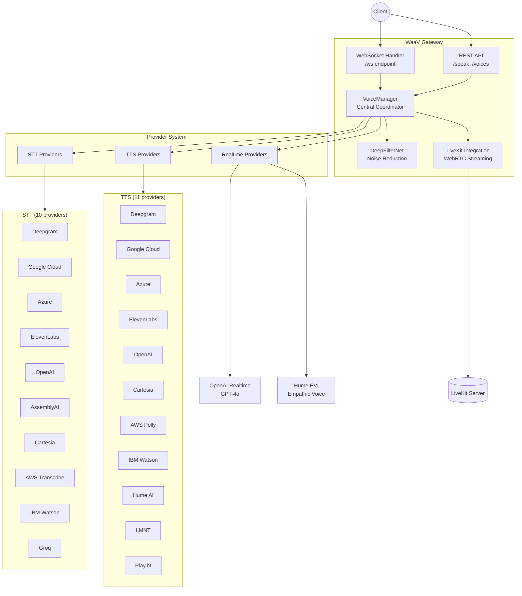
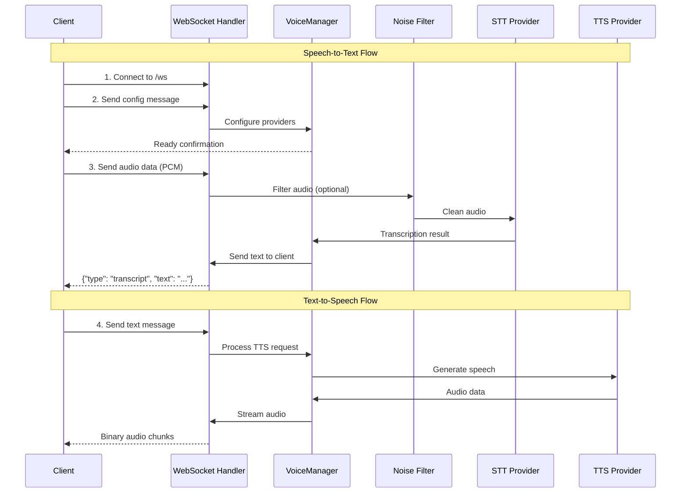
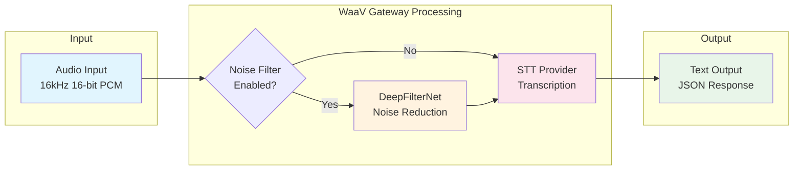
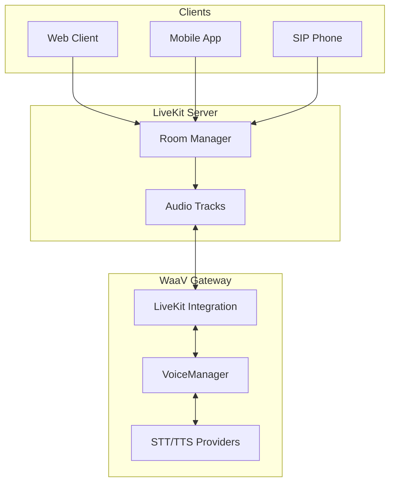

# WaaV Gateway

A high-performance real-time voice processing server built in Rust that provides unified Speech-to-Text (STT) and Text-to-Speech (TTS) services through WebSocket and REST APIs.


## Features

- **Unified Voice API**: Single interface for multiple STT/TTS providers
- **Real-time Processing**: WebSocket-based bidirectional audio streaming
- **LiveKit Integration**: WebRTC audio streaming with room-based communication
- **Advanced Noise Filtering**: Optional DeepFilterNet integration (`noise-filter` feature)
- **Provider Flexibility**: Pluggable architecture supporting 10+ providers
  - Deepgram (STT/TTS)
  - ElevenLabs (STT/TTS)
  - Google Cloud (STT/TTS) - WaveNet, Neural2, and Studio voices
  - Microsoft Azure (STT/TTS) - 400+ neural voices across 140+ languages
  - OpenAI (STT/TTS/Realtime) - Whisper, TTS-1, GPT-4o Realtime API
  - AssemblyAI (STT) - Streaming API v3, 99 languages, immutable transcripts
  - Cartesia (STT/TTS) - Ultra-low latency Sonic model
  - AWS Transcribe/Polly (STT/TTS) - Enterprise-grade with 100+ languages
  - IBM Watson (STT/TTS) - 30+ languages, speaker diarization, neural voices
  - Groq (STT) - Ultra-fast Whisper (216x real-time), $0.04/hour
  - Play.ht (TTS) - Low-latency (~190ms), PlayDialog multi-turn, 36+ languages, voice cloning
- **Realtime AI APIs**: Full-duplex audio-to-audio streaming
  - OpenAI Realtime - GPT-4o voice conversations
  - Hume EVI - Empathic Voice Interface with emotion understanding
- **Audio-Disabled Mode**: Development mode without API keys

## Quick Start

### Prerequisites

- Docker
- At least one provider API key (optional - can run in audio-disabled mode)

### Run with Docker

```bash
docker run -d \
  -p 3001:3001 \
  -e DEEPGRAM_API_KEY=your-key \
  waav-gatewayai/waav-gateway
```

The server will be available at `http://localhost:3001`.

### Docker Compose

```yaml
version: "3.9"
services:
  waav-gateway:
    image: waav-gatewayai/waav-gateway
    ports:
      - "3001:3001"
    environment:
      DEEPGRAM_API_KEY: ${DEEPGRAM_API_KEY}
      ELEVENLABS_API_KEY: ${ELEVENLABS_API_KEY}
      CACHE_PATH: /data/cache
    volumes:
      - waav-gateway-cache:/data/cache

volumes:
  waav-gateway-cache: {}
```

For complete Docker documentation including LiveKit integration, see [docs/docker.md](docs/docker.md).

### Running Without API Keys (Audio-Disabled Mode)

You can run WaaV Gateway without Deepgram or ElevenLabs API keys by using the audio-disabled mode. Simply start the server without configuring the API keys, then send a WebSocket configuration message with `audio_disabled: true`:

```json
{
  "type": "config",
  "config": {
    "audio_disabled": true,
    "stt_provider": "deepgram",
    "tts_provider": "elevenlabs"
  }
}
```

This mode is useful for:
- Local development and testing
- UI/UX development without audio processing
- Testing WebSocket message flows
- Debugging non-audio features

## Authentication (Optional)

WaaV Gateway supports customer-based authentication that delegates token validation to an external authentication service. When enabled, protected API endpoints require a valid bearer token.

### Enabling Authentication

Add to your `.env` file:
```env
AUTH_REQUIRED=true
AUTH_SERVICE_URL=https://your-auth-service.com/auth
AUTH_SIGNING_KEY_PATH=/path/to/auth_private_key.pem
AUTH_TIMEOUT_SECONDS=5
```

Generate signing keys:
```bash
# Generate RSA private key
openssl genrsa -out auth_private_key.pem 2048

# Extract public key (share with auth service)
openssl rsa -in auth_private_key.pem -pubout -out auth_public_key.pem
```

### Making Authenticated Requests

```bash
curl -X POST http://localhost:3001/speak \
  -H "Authorization: Bearer your-token-here" \
  -H "Content-Type: application/json" \
  -d '{"text": "Hello world"}'
```

For complete authentication setup and architecture details, see [docs/authentication.md](docs/authentication.md).

## Security Features

WaaV Gateway includes comprehensive security hardening for production deployments:

### SSRF Protection
All webhook URLs are validated to prevent Server-Side Request Forgery attacks:
- HTTPS required for all webhooks
- Raw IP addresses blocked (both IPv4 and IPv6)
- DNS resolution checked against private IP ranges
- Configurable for development mode with `validate_webhook_url_dev()`

### Connection Limiting
Per-IP connection limits prevent resource exhaustion:
- Configurable via `MAX_CONNECTIONS_PER_IP` (default: 100)
- Global rate limiting via `RATE_LIMIT_REQUESTS_PER_SECOND` (default: 60/s)
- Burst allowance via `RATE_LIMIT_BURST_SIZE` (default: 10)

### Tenant Isolation
Multi-tenant deployments benefit from automatic resource scoping:
- Recording paths include `auth_id` for tenant isolation
- WebSocket sessions tracked by authentication context
- SIP hooks support per-tenant webhook routing

### Resource Management
Production-grade resource controls:
- Bounded channels prevent memory exhaustion under load
- HTTP connection pools with explicit limits and idle timeouts
- WebSocket idle timeout with jitter (prevents thundering herd)
- Pre-deserialization message size validation

## API Endpoints

### WebSocket

- **Endpoint**: `/ws`
- **Protocol**: WebSocket
- **Purpose**: Real-time bidirectional audio streaming and control

#### Message Types

**Configuration Message**:
```json
{
  "type": "config",
  "config": {
    "stt_provider": "deepgram",
    "tts_provider": "elevenlabs",
    "audio_disabled": false,
    "deepgram_model": "nova-2",
    "elevenlabs_voice_id": "voice_id_here"
  }
}
```

**Groq STT Configuration** (ultra-fast Whisper):
```json
{
  "type": "config",
  "config": {
    "stt_provider": "groq",
    "groq_model": "whisper-large-v3-turbo",
    "language": "en"
  }
}
```

**Audio Input**: Binary audio data (16kHz, 16-bit PCM)

**Text Input**:
```json
{
  "type": "text",
  "text": "Convert this text to speech"
}
```

### REST API

- **Health Check**: `GET /` - Server health check endpoint
- **Voices**: `GET /voices` - List available TTS voices (requires auth if `AUTH_REQUIRED=true`)
- **Speak**: `POST /speak` - Generate speech from text (requires auth if `AUTH_REQUIRED=true`)
- **LiveKit Token**: `POST /livekit/token` - Generate LiveKit participant token (requires auth if `AUTH_REQUIRED=true`)
- **LiveKit Webhook**: `POST /livekit/webhook` - Webhook endpoint for LiveKit events (unauthenticated, uses LiveKit signature verification)
  - Called by LiveKit to deliver room and participant events
  - Validates requests using LiveKit's JWT signature mechanism
  - Logs SIP-related attributes for phone call troubleshooting
  - See [docs/livekit_webhook.md](docs/livekit_webhook.md) for details

## Architecture Overview

### Core Components



### Request Flow



### Audio Processing Pipeline



### LiveKit Integration



## Development

For local development, you can build and run from source.

### Prerequisites

- Rust 1.88.0 or later
- Optional: ONNX Runtime (for turn detection feature)

### Building from Source

```bash
# Development build
cargo build

# Release build (optimized)
cargo build --release

# Run the server
cargo run

# Run with a config file
cargo run -- -c config.yaml
```

### Feature Flags

WaaV Gateway exposes several Cargo features that gate heavyweight subsystems:

- `turn-detect`: ONNX-based speech turn detection
- `noise-filter`: DeepFilterNet noise suppression pipeline
- `openapi`: OpenAPI 3.1 specification generation

```bash
# Run with turn detection
cargo run --features turn-detect

# Run with noise filter
cargo run --features noise-filter

# Run with multiple features
cargo run --features turn-detect,noise-filter,openapi
```

The Docker image includes `turn-detect` and `noise-filter` by default.

### Testing

```bash
# Run all tests
cargo test

# Run specific test
cargo test test_name

# Run with output
cargo test -- --nocapture
```

### Code Quality

```bash
# Format code
cargo fmt

# Run linter
cargo clippy

# Check for security vulnerabilities
cargo audit
```

### Building Docker Image Locally

```bash
# Build Docker image
docker build -t waav-gateway .

# Run container
docker run -p 3001:3001 --env-file .env waav-gateway
```

## Configuration

### Environment Variables

| Variable | Description | Default | Required |
|----------|-------------|---------|----------|
| `DEEPGRAM_API_KEY` | Deepgram API authentication | - | No* |
| `ELEVENLABS_API_KEY` | ElevenLabs API authentication | - | No* |
| `GOOGLE_APPLICATION_CREDENTIALS` | Path to Google Cloud service account JSON | - | No* |
| `AZURE_SPEECH_SUBSCRIPTION_KEY` | Azure Speech Services subscription key | - | No* |
| `AZURE_SPEECH_REGION` | Azure region (e.g., eastus, westeurope) | `eastus` | No* |
| `OPENAI_API_KEY` | OpenAI API key (for STT, TTS, and Realtime) | - | No* |
| `ASSEMBLYAI_API_KEY` | AssemblyAI API key (for streaming STT) | - | No* |
| `CARTESIA_API_KEY` | Cartesia API key (for STT/TTS) | - | No* |
| `AWS_ACCESS_KEY_ID` | AWS access key (for Transcribe/Polly) | - | No* |
| `AWS_SECRET_ACCESS_KEY` | AWS secret key (for Transcribe/Polly) | - | No* |
| `IBM_WATSON_API_KEY` | IBM Watson API key (for STT/TTS) | - | No* |
| `IBM_WATSON_INSTANCE_ID` | IBM Watson service instance ID | - | No* |
| `GROQ_API_KEY` | Groq API key (for ultra-fast Whisper STT) | - | No* |
| `PLAYHT_API_KEY` | Play.ht API key (for TTS) | - | No* |
| `PLAYHT_USER_ID` | Play.ht user ID (for TTS authentication) | - | No* |
| `HUME_API_KEY` | Hume AI API key (for EVI realtime and TTS) | - | No* |
| `LIVEKIT_URL` | LiveKit server WebSocket URL | `ws://localhost:7880` | No |
| `LIVEKIT_API_KEY` | LiveKit API key (for webhooks and token generation) | - | No*** |
| `LIVEKIT_API_SECRET` | LiveKit API secret (for webhooks and token generation) | - | No*** |
| `HOST` | Server bind address | `0.0.0.0` | No |
| `PORT` | Server port | `3001` | No |
| `AUTH_REQUIRED` | Enable authentication | `false` | No |
| `AUTH_API_SECRETS_JSON` | API secrets JSON array (`[{id, secret}]`) | - | Yes** |
| `AUTH_API_SECRET` | Legacy single API secret | - | No**** |
| `AUTH_API_SECRET_ID` | Legacy API secret id for `AUTH_API_SECRET` | `default` | No |
| `AUTH_SERVICE_URL` | External auth service endpoint | - | Yes** |
| `AUTH_SIGNING_KEY_PATH` | Path to JWT signing private key | - | Yes** |
| `AUTH_TIMEOUT_SECONDS` | Auth request timeout | `5` | No |

*Not required when using audio-disabled mode
**Required when `AUTH_REQUIRED=true` for the auth method you choose
***Required for LiveKit webhook validation and token generation features
****Legacy single-secret fallback; prefer `AUTH_API_SECRETS_JSON`

### SIP Configuration (Optional)

WaaV Gateway supports first-class SIP configuration for managing SIP-specific settings. See [docs/sip_config.md](docs/sip_config.md) for detailed documentation.

**YAML Configuration:**
```yaml
sip:
  room_prefix: "sip-"
  allowed_addresses:
    - "192.168.1.0/24"
    - "10.0.0.1"
  hook_secret: "your-signing-secret"  # Required if hooks configured
  hooks:
    - host: "example.com"
      url: "https://webhook.example.com/events"
```

**Important:** All SIP webhook forwarding requests are signed with HMAC-SHA256. You **must** configure `hook_secret` (or per-hook `secret` overrides) if using `sip.hooks`. See [docs/livekit_webhook.md#webhook-signing](docs/livekit_webhook.md#webhook-signing) for signature verification examples.

**Environment Variables:**
- `SIP_ROOM_PREFIX`: Room name prefix for SIP calls (required if SIP enabled)
- `SIP_ALLOWED_ADDRESSES`: Comma-separated IP addresses/CIDRs
- `SIP_HOOK_SECRET`: Global signing secret for webhook authentication (min 16 chars)
- `SIP_HOOKS_JSON`: JSON array of webhook configurations (with optional per-hook `secret` field)

## Performance Considerations

- **DeepFilterNet**: CPU-intensive processing uses thread pooling
- **Audio Buffering**: Optimized chunk processing for low latency
- **Connection Reuse**: Provider connections are maintained for efficiency
- **Async Processing**: Non-blocking WebSocket message handling
- **Memory Management**: Careful buffer management in audio loops

## Contributing

1. Review the development rules in `.cursor/rules/`:
   - `rust.mdc`: Rust best practices
   - `core.mdc`: Business logic specifications
   - `axum.mdc`: Framework patterns
   - `livekit.mdc`: LiveKit integration details

2. Follow the existing code patterns and conventions
3. Add tests for new features
4. Ensure `cargo fmt` and `cargo clippy` pass

## Support

For issues, questions, or contributions, please visit the [GitHub repository](https://github.com/waav-gatewayai/waav-gateway).
